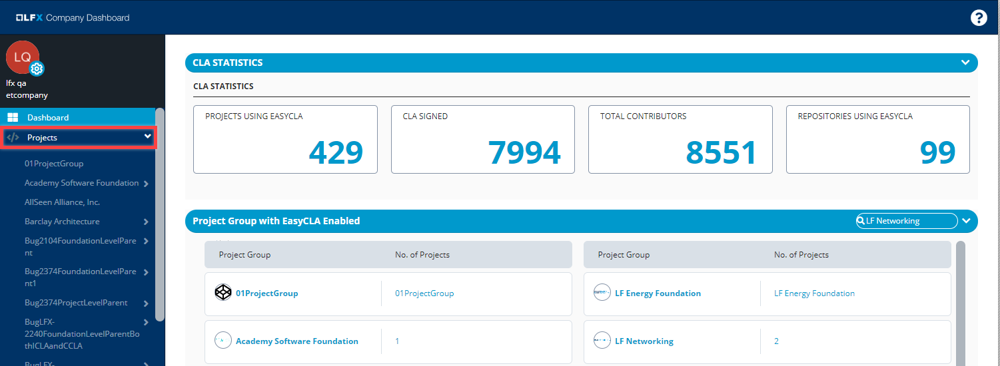

# Projects

Click **Projects** to view all the CLA enabled projects.

Click a project group or project to view related CLA information.

## Project Group / Project

Data under a project group is an aggregate data of all the projects that come under the project group. Following sections display CLA information for a project:

### CLA STATISTICS

This provides CLA highlights for the project group.

* **CLA SIGNED** shows total number of individual CLA and corporate CLA signed by your company for the project group. This does not include approved contributors.
* **TOTAL CONTRIBUTORS** shows the total number of individual and corporate contributors including approved contributors who contribute to the project group.
* **REPOSITORIES USING EASYCLA** shows total number git repositories of projects under the project group that use EasyCLA

Data in the following sections are displayed based on:

* [If company has signed CLA](./#if-company-has-signed-cla)
* [If company has not signed CLA](./#if-company-has-not-signed-cla)

## If Company has signed CLA


**Important:** CLA Managers of a project can add another user as a CLA manager and/or contributor or delete such added users for the same project, however can view CLA managers, Approved List, and Contributor Acknowledgements for other projects of the company. All other roles can view CLA details for the project.


#### CLA FOR MY ORGANIZATION / ACTIVE CLAs FOR MY ORGANIZATION 

It shows a table that lists the CLAs signed by your company with the project:

* **Project** shows name and logo of the project with which CLA is signed.
* **Projects Using** \(Only for Project Group\) shows the names of the individual projects under the project group that are CLA enabled. 
* **CLA Type** \(Only for Project Group\) shows at which level the CLA is signed, for example, project group level or project level.
* **CLA Group** shows CLA group name which the project belong to. A project can have multiple CLA groups.
* **Status** shows CLA status—Signed/Not signed.
* **Signed on** shows the date when CLA was signed.
* **Signed By** shows name of the person who signed the CLA.
* **Download** lets you download PDF file of the signed CLA.

#### CLA MANAGERS FROM MY ORGANIZATION 

It shows a table that lists CLA managers of your company including their details.

* **Name** shows name and image of the CLA Manager
* **Email Address** shows email address of the CLA Manager.
* **Added on** shows the date when the individual was added as CLA Manager.
* **Manage** \(Only for CLA Managers\) lets CLA managers [delete](../../easycla/cla-managers/add-or-delete-cla-managers.md#delete-a-cla-manager) the added CLA managers. Each project has at least one CLA manager. If there is only one CLA manager for a project, that person's details cannot be deleted.
* **+ Add CLA Manager** \(Only for CLA Managers\) lets you [add](../../easycla/cla-managers/add-or-delete-cla-managers.md#add-a-cla-manager) a user as a CLA manager.

#### APPROVED LIST OF CONTRIBUTORS FROM MY ORGANIZATION 

It shows a table that lists details of approved contributors from your organization for the project.

* **Approved List** shows the user name/email lD/GitHub user ID /GitHub Organization or Domain name that is in the approved list.
* **Coverage Type** shows the type with which the contributor is listed in the approved list.
* **Added on** **shows** the date when the user was added to the approved list.
* **Manage** \(Only for CLA Managers\) lets CLA managers [edit](../../easycla/cla-managers/add-and-manage-contributors.md#edit-a-contributors-details) or [delete](../../easycla/cla-managers/add-and-manage-contributors.md#delete-a-contributors-details) the approved list.

**+Add Contributor\(s\)** is displayed only for CLA Managers, and lets CLA managers [add contributors](../../easycla/cla-managers/add-and-manage-contributors.md#add-contributor-s) to an approved list.

#### CONTRIBUTOR ACKNOWLEDGEMENT FROM MY ORGANIZATION 

It shows a table that lists contributors from your company associated with this project who have completed contributor acknowledgments.

* **Name** shows the name and image of the contributor. Data is retrieved from the individual profile page.
* **LFID/GHID** shows the Linux Foundation ID or GitHub ID of the contributor.
* **Agreement** shows the version of CLA agreement that was signed by the contributor.
* **Timestamp** shows date and time when the user acknowledged the agreement.

**Search** lets you to search a contributor by name and LFID/GHID.

#### RECENT ACTIVITY LOG FOR MY ORGANIZATION 

It shows recent activities of your company for the project. The activity-log displays activity details, project name and logo for which the activity happened along with date and time.

**CLA STATISTICS FOR MY ORGANIZATION** \(Only for Project Group\)

This is displayed only for project groups, and shows a table that lists the following information:

* **Projects** shows the names of the CLA enabled projects that come under the project group.
* **My CLA Managers** shows number of CLA managers per project.
* **My Approved List** shows  number of approved lists per project.

## If Company has not signed CLA

**Note:** For a project under a project group, CLA must be signed at the project group level.

Following is an example that appears if your company has not signed CLA for a project or a project group. Sign CLA for a project or designate someone to sign CLA for the project. For details, see [Sign Corporate CLA for a Company](../../easycla/cla-manager-designee-or-initial-cla-manager/sign-corporate-cla-for-a-company.md).

