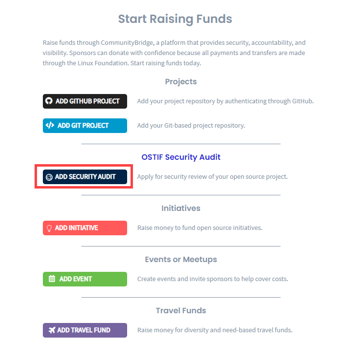

# Add a Project for Security Audit

As a project administrator, you can submit an application to [Open Source Technology Improvement Fund](https://ostif.org/the-ostif-mission/)\(OSTIF\) through CommunityBridge Funding by adding a Git based open source project. OSTIF reviews your application, and if approved, it determines the funding goal amount for your project. OSTIF can also add your project to CommunityBridge Funding to help your project in doing a security audit and raising funds. After OSTIF adds your project, and confirms with you, you can make necessary changes to your project, for example adding repository URL. 


Security audit funding goal is determined by OSTIF.


Linux Foundation requires access to your code repository to support security vulnerability scanning. The application process requires you to authenticate your GitHub ID to grant Linux Foundation read-only access to the repositories you maintain.

### To apply to Security Audits \(OSTIF\):

1. [Sign in](../../../sso/sign-in/) to [CommunityBridge Funding](https://funding.communitybridge.org/).
2. Click **Apply** and select **ADD SECURITY AUDIT**.   
3. Complete the application form. Red asterisks indicate required fields. For information about fields, see [Security Audit Application ](../security-audit-application.md)form.
4. Click **Submit Application.  
   Note:** If you, as a project administrator, apply for security audit,  OSTIF reviews your application, determines the security audit funding goal post which you must add the funding goal in the respective field as shown in the [Security Audit Application ](../security-audit-application.md)form.

   The Linux Foundation administrator will review and approve or reject the application. The Linux Foundation will set up the financial aspects of your project and contributors, such as Expensify accounts and a project expense policy.

5. \(Optional\) Go to your user account and select **My Projects** to see your pending project.


You can edit your project at any time. Select the project you want to update and select **Edit Project.**


  

