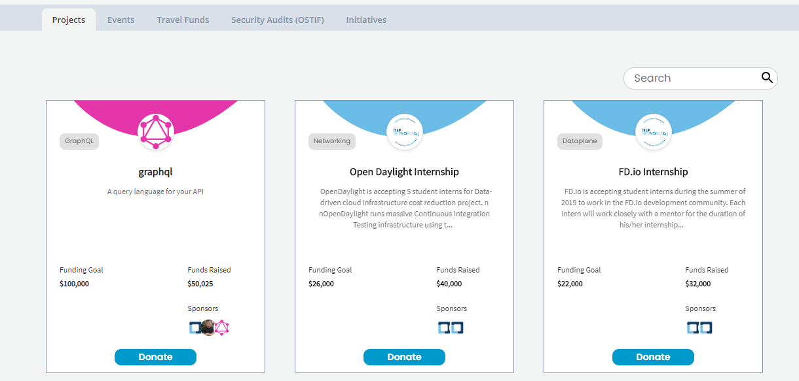
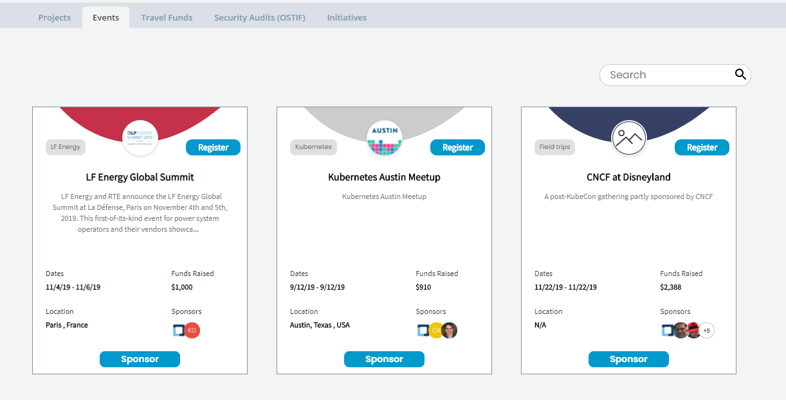
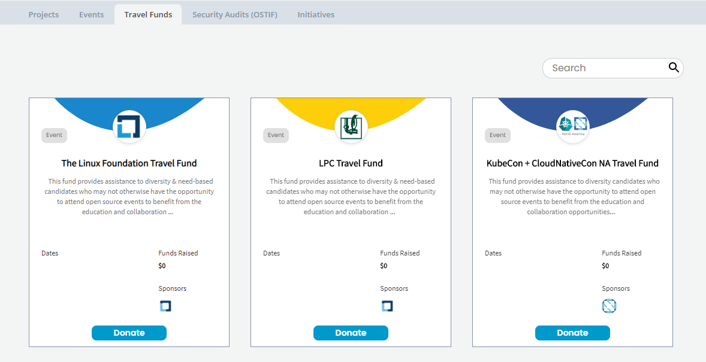
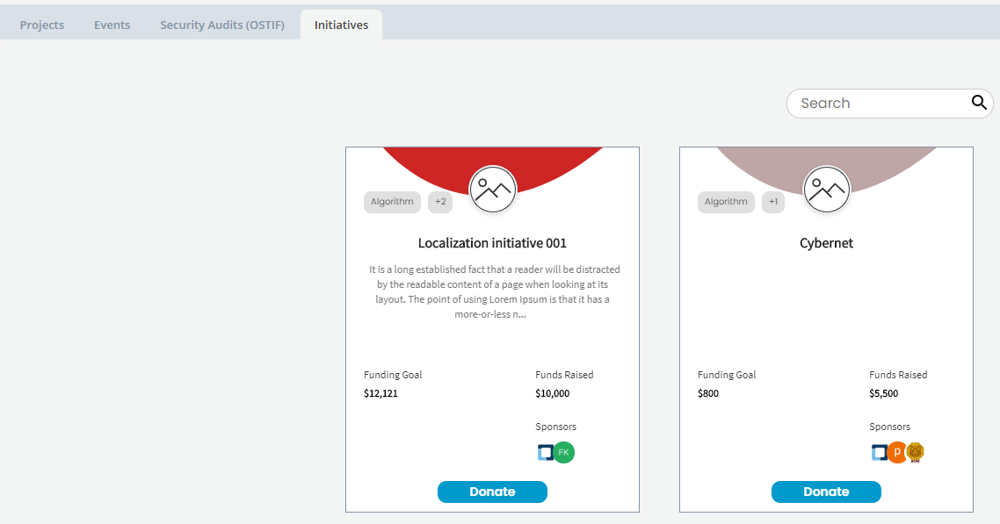

# Dashboard

### Getting Started

1. Open [Funding](https://funding.communitybridge.org/). Projects tab appears.
2. From **Projects** tab, click a **project** of interest or search for a project. The landing page shows overview of the project.
3. Browse Dashboard for information. Click the **Financial** tab to see transaction details. **Note:** The Home screen shows the overview of the project.
4. Navigate to each tab, such as Events, Security Audits \(OSTIF\) Mentors, Initiatives, and click an entity under a tab to know more about the entity:
   * [Projects](./#Dashboard-ProjectsandMentorships)
   * [Events](./#Dashboard-Events)
   * [Security Audits \(OSTIF\)](./#security-audits-ostif)
   * [Initiatives](./#initiatives)
   * [Travel Funds](./#Dashboard-TravelScholarships)
5. Participate:
   * [Apply to raise fund for a project](../apply-for-funding/)
     * [Add a GitHub project](../apply-for-funding/add-a-github-project.md)
     * [Add a Git project](../apply-for-funding/add-a-git-project.md)
     * [Add a project for security audit](../apply-for-funding/add-a-project-for-security-audit.md)
     * [Add initiatives](../apply-for-funding/add-initiatives.md)
     * [Add an event](../apply-for-funding/add-an-event.md)
     * [Add a travel fund](../apply-for-funding/add-a-travel-fund.md)
   * [Donate/Sponsor to projects](../donate-sponsor/)
   * [Register to participate in an event](../register-for-an-event.md)

## Projects 

**Projects** \(the default selection\) lists Git projects. Project overview information shows the number of sponsors, the CII badgefor a participant in the [Core Infrastructure Initiative \(CII\) Badge Program](https://www.coreinfrastructure.org/programs/badge-program/), and so on. The color of the badge represents the CII status. 

For each project, the project card shows the following information:

* Project name, logo, and description.
* Technologies or Categories the project is associated with.
* Funding Goal shows total funding goal for the project.
* Funds Raised shows total funds raised so far.
* Sponsors shows images of sponsors \(Individuals and Organizations\) for the project.
*  **Donate** lets you donate funds to a project that you want to support.

To know more about a project, see [Projects](projects.md).

## Events 

**Events** lists events, such as forums or conferences. Event funds can benefit and reimburse organizers for event expenses, such as for a venue or food. For each event, the event card shows the following information:

* Name, logo, and description of the event.
* Dates shows the beginning and end dates of the event.
* Funds Raised shows total amount of funds raised for the event.
* Location shows the place where the event takes place.
* Sponsors shows images of sponsors \(Individuals and Organizations\) for the event.
* **Sponsor** lets you donate funds to an event that you want to support.
* **Register** lets you register to attend the event.

To know more about events, see [Events](events.md).

## Travel Funds 

**Travel Funds** lists travel funds for project related events and meet-ups, for example a travel fund to attend a women's conference. For each travel fund, a travel fund card shows the following information:

* Travel Fund name, logo, and description.
* Technologies or Categories the travel related event or meet-up is associated with.
* Dates show the start date and end date of the meet up or event.
* Funds Raised shows total funds raised so far.
* Sponsors shows images of sponsors \(Individuals and Organizations\) for the travel fund.
*  **Donate** lets you donate funds to a travel fund that you want to support. You can donate as an [individual](../donate-sponsor/donate-as-an-individual.md) or as a [sponsor organization](../donate-sponsor/donate-as-a-sponsor/).

To know more, see [Travel Funds](travel-funds.md).

## Security Audits \(OSTIF\)

**Security Audits \(OSTF\)** lists all the projects that are applied for security audit to [Open Source Technology Improvement Fund](https://ostif.org/the-ostif-mission/) \(OSTIF\). Following is the process followed by OSTIF for security audit:

1. OSTIF hires professional auditors and organizes communication between application developers and the audit team.
2. Developers provide code to auditors to evaluate for vulnerabilities.
3. Auditors supply the developers with the results of the evaluation and assist with fixing/strengthening the code to make the software strong and trustworthy.
4. The updated code is released to the public and OSTIF begins providing a bug bounty. This allows people from all over the world to have an opportunity to evaluate the code for themselves and find vulnerabilities for rewards.
5. The developers continue to upgrade and strengthen the software before starting the next audit.

Click **Donate** to donate to the project. To know more, see [Security Audit](security-audit.md).

Following example show a project that is applied for security audit.

## Initiatives

Initiatives lists all the different types of initiatives for which people have raised funds. You can click an initiative to learn more about it. For details to know about an initiative, see the [project/initiative details](projects.md). Click  **Donate** to support the initiative. To know more, see [Initiatives](initiatives.md).

### Learn more:

* [Integrated Services for a Project](integrated-services-for-a-project.md)
* [Search](search.md)
* [Toggle Between Funding and Mentorship for a Project](toggle-between-funding-and-mentorship-for-a-project.md)

