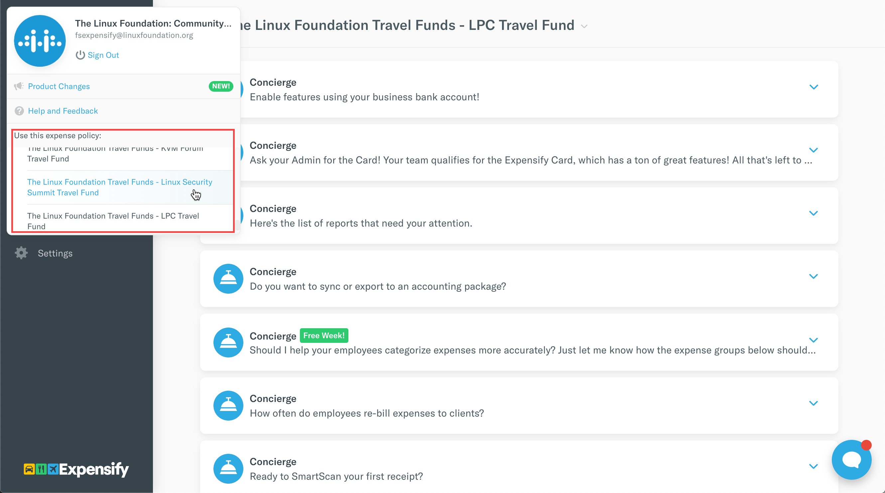
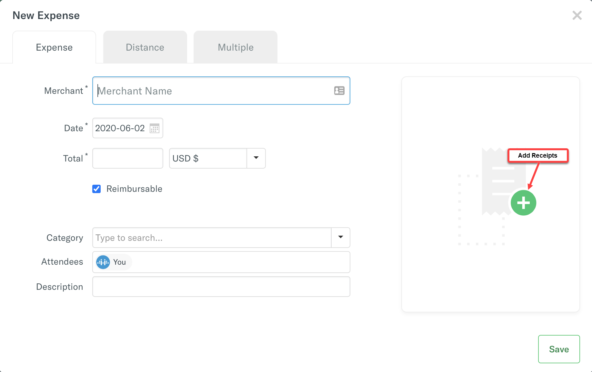

# How to Create and Submit an Expensify Report

Consolidate all of the travel expenses eligible for reimbursement to apply them to the report.

**Follow these steps:**

**Note:** Ensure that you select the travel fund policy that is associated with the event you are approved for.

1. Under your account, select **Reports** tab.

2. On **Reports** page, select **New Report** located in the top-right corner of your screen.

3. Write a **Report Name** that must include your name, and the name and year of the event, for example:`Jane Brown - Open Source Summit + Embedded Linux Conference North America 2020`

4. Click to add expenses to report.

5. On Add Expense To Report window, click **New Expense**.

6. Click  on **New Expense** window to add receipt, and provide receipt details.  
**Merchant:** Name of the Merchant.  
**Date:** Date of Purchase  
**Total:** Total amount in USD$  
**Category:** Choose a category—Accommodation, Airfare, Ground Transportation, Other.


**Important:** For International \(non-U.S.\) reimbursements, upload a completed _The Linux Foundation Wire Transfer Form_ in addition to your receipt\(s\).




7. Click **Save** and repeat Step 6 to add more receipts.

8. After you add the travel expenses that are eligible for reimbursement, click **Submit** located in the top left corner of the **Reports** tab.

 

