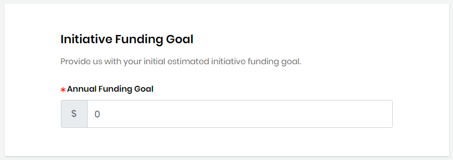

# Initiative Application

## Initiative Details

<table>
  <thead>
    <tr>
      <th style="text-align:left">Name</th>
      <th style="text-align:left">Description</th>
    </tr>
  </thead>
  <tbody>
    <tr>
      <td style="text-align:left"><b>Initiative Name</b>
      </td>
      <td style="text-align:left">
        
Name of your Initiative for which you want to raise money. This name will
          appear on Initiative tab of CommunityBridge Funding website.

        
<b>Note: </b>This name must be unique&#x2014;no other project can exist
          in CommunityBridge Funding platform with the same name. However, funds
          of a different type can use the same name. For example, a Travel Fund and
          a Project fund can use the same name.

      </td>
    </tr>
    <tr>
      <td style="text-align:left"><b>Topic</b> / <b>Category</b>
      </td>
      <td style="text-align:left">Topic or category that relates to your Travel Fund.
         Click
        after you select category/ categories. The added categories are reflected
        in the <b>List of categories you have added... </b>field.</td>
    </tr>
    <tr>
      <td style="text-align:left"><b>Elevator pitch</b>
      </td>
      <td style="text-align:left">Brief statement of why your Initiative is important to be supported.</td>
    </tr>
    <tr>
      <td style="text-align:left"><b>Website URL</b>
      </td>
      <td style="text-align:left">Web address that you want to associate with the fund.</td>
    </tr>
  </tbody>
</table>

## Initiative Branding

| Name | Description |
| :--- | :--- |
| **Initiative Logo** | Symbol or other design adopted by your organization identifies your Initiative. Click **Browse** to upload a JPG, PNG, or SVG file. Preview shows the logo that you uploaded. A logo helps your page stand out. |
| **Accent Color** | Hexadecimal number for the color that you want use as your initiative brand. for example, \#008000 is green. Enter a **hexadecimal number** or click in the field to open the color picker. Use the picker by clicking inside the color field to pick a color. You can use the up/down arrows to refine the color by editing the color values. The gray field refreshes to match your selection. |

## Initiative Beneficiaries

Initiative beneficiaries are individuals who can benefit from the funds, or people who you want to sponsor for related activities.  
**Note:** You will be automatically added as a beneficiary when you submit a new initiative application. To add more beneficiaries, click **+ Add beneficiary** and complete the fields that appear.

| Name | Description |
| :--- | :--- |
| **Name** | Name of the person who you want to designate as a beneficiary of funds. |
| **Email** | Email of the individual. |

Click  after you enter name and email address of the person you want to add as a beneficiary. 

## Initiative Funding Goal

In the Annual Funding Goal filed, provide an initial funding goal estimated for the initiative.

## Terms and Conditions 

Read the Terms and Conditions, and select the checkbox.

