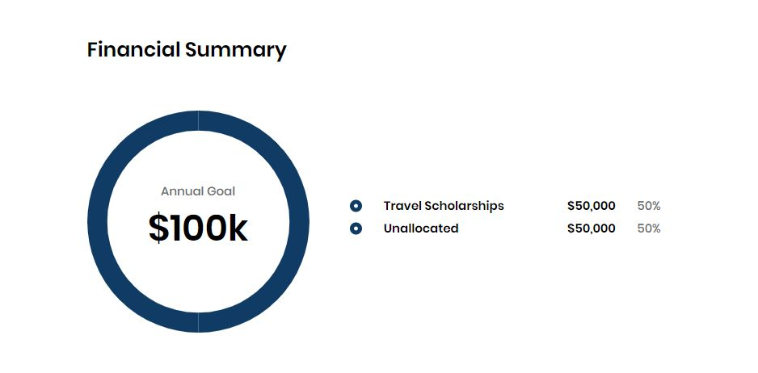

# Travel Fund Application

## Travel Fund Details 

<table>
  <thead>
    <tr>
      <th style="text-align:left">Name</th>
      <th style="text-align:left">Description</th>
    </tr>
  </thead>
  <tbody>
    <tr>
      <td style="text-align:left"><b>Travel Fund Name</b>
      </td>
      <td style="text-align:left">
        
Name of your Travel Fund. This name will appear on Travel Fund tab of
          CommunityBridge Funding website.

        
<b>Note: </b>This name must be unique&#x2014;no other project can exist
          in CommunityBridge Funding platform with the same name. However, funds
          of a different type can use the same name. For example, a Travel Fund and
          a Project fund can use the same name.

      </td>
    </tr>
    <tr>
      <td style="text-align:left"><b>Topic</b> / <b>Category</b>
      </td>
      <td style="text-align:left">Topic or category that relates to your Travel Fund.
         Click
        after you select category/ categories. The added categories are reflected
        in the <b>List of categories you have added... </b>field.</td>
    </tr>
    <tr>
      <td style="text-align:left"><b>Elevator pitch</b>
      </td>
      <td style="text-align:left">Brief statement of why your Travel Fund is important to support.</td>
    </tr>
    <tr>
      <td style="text-align:left"><b>Website URL</b>
      </td>
      <td style="text-align:left">Web address that you want to associate with the fund.</td>
    </tr>
    <tr>
      <td style="text-align:left"><b>Application URL</b>
      </td>
      <td style="text-align:left">The specific URL where people can apply for travel fund.</td>
    </tr>
    <tr>
      <td style="text-align:left"><b>Start Date</b>
      </td>
      <td style="text-align:left">Start date of your travel fund.</td>
    </tr>
    <tr>
      <td style="text-align:left"><b>End Date</b>
      </td>
      <td style="text-align:left">Ens date of your travel fund.</td>
    </tr>
  </tbody>
</table>

## Travel Fund Branding

| Name | Description |
| :--- | :--- |
| **Travel Fund Logo** | Symbol or other design adopted by your organization identifies your Travel Fund. Click **Browse** to upload a JPG, PNG, or SVG file. Preview shows the logo that you uploaded. A logo helps your page stand out. |
| **Accent Color** | Hexadecimal number for the color that you want use as your fund brand. for example, \#008000 is green. Enter a **hexadecimal number** or click in the field to open the color picker. Use the picker by clicking inside the color field to pick a color. You can use the up/down arrows to refine the color by editing the color values. The gray field refreshes to match your selection. |

## Travel Fund Beneficiaries

Travel fund beneficiaries are individuals who can benefit from the funds, or people whom you want to sponsor for related activities.  
**Note:** You will be automatically added as a beneficiary when you submit a new travel fund application. To add more beneficiaries, click **+ Add beneficiary** and complete the fields that appear.

| Name | Description |
| :--- | :--- |
| **Name** | Name of the person who you want to designate as a beneficiary of funds. |
| **Email** | Email of the individual. |

Click  after you enter name and email address of the person you want to add as a beneficiary. 

View beneficiaries section:

After the application is approved, the Linux Foundation finance team sets up an individual Expensify account for each beneficiary. Then, each beneficiary receives an email from the finance team with a notification that includes a link to their Expensify account.

The finance team also works with you to set up a specific expense policy that applies to the Travel Fund. All the beneficiary and fund expenses are controlled through the expense policy. For example, the policy might state a hotel price range that is acceptable for beneficiaries or a per diem food allowance.

Only you \(the person who submitted this application\) can add or remove beneficiaries. The finance team is notified and adjusts the Expensify accounts accordingly.

## Travel Fund Budget 

**Annual Travel Fund Budget Total** is a total funding budget for the year. The Total Budget is the sum of the individual goal amounts.

## Travel Fund Funding Distribution 

Enable goals for how you want to distribute funds in your Travel fund, and complete the fields that appear—see the example below. Enter a percentage of your Annual Funding Goal amount to designate towards the goal. You can use the up/down arrows to select a percentage also.

Be clear to potential sponsors about how you intend to use the funds. You can designate funds towards different types of expenses. These amounts are targets not limits, so you can continue raising money beyond the designated amount. As you see progress in one or more goals, you can \(and should\) update the goals to reflect how you plan to utilize these additional funds. 

You can create a custom goal by clicking  . For details, see [Custom Goal](travel-fund-application.md#custom-goal).

## Custom Goal

You can add custom goals to designate funds towards different types of expenses, such as venue, food, and so on.

Click **Add Travel Funding Goal** and complete the fields that appear. Click **Delete** to delete the goal.

| Name | Description |
| :--- | :--- |
| **Goal name** | Name of your goal. |
| **Goal Description** | A brief description about your goal. |
| **Goal Color** | Hexadecimal number for the color that you want for your goal to use, for example, \#008000 is green. Enter a **hexadecimal number** or click in the field to open the color picker. Use the picker by clicking inside the color field to pick a color. You can use the up/down arrows to refine the color by editing the color values. The gray field refreshes to match your selection. |
| **Goal Icon** | Symbol or other design adopted by your organization to identify your page—a logo helps your page stand out. Click **Browse** to upload a JPG, PNG, or SVG file. Preview shows the logo that you uploaded. |
| **Goal allocation** | A percentage of the total goal amount that you want designated for this goal. |

## Financial Summary 

The Financial Summary shows the annual financial goal and progress towards it by individual goal.

## Terms and Conditions 

Read the Terms and Conditions, and select the checkbox.

