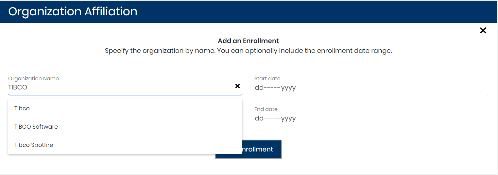

# Add or Delete a Profile Organization Affiliation

Organizations are shared accounts where open source projects can collaborate across many projects at once. Affiliation Management lets you:

* Affiliate a profile with one or more organizations and for a specific enrollment period—this means that Dev Analytics counts the affiliated profile data in various organization charts and graphs.
* Delete an organization affiliation—this means that Dev Analytics does not count the affiliated profile data in organization charts and graphs.

**Do these steps:**

1. Select a **project name** of interest.
2. Select **Affiliation Management**.
3. Select a profile from **Top Unaffiliated Contributors** list or [search for a profile](find-a-profile.md).
4. Click a **row** that corresponds to a name of interest. Profile Information appears.
5. Go to **Organization Affiliation**. Organizations and their corresponding enrollment dates are listed.
6. Continue to add or delete organization affiliations:
   * [Add an Organization Affiliation](add-or-delete-a-profile-organization-affiliation.md#AddorDeleteaProfileOrganizationAffiliation-AddanOrganizationAffiliation)
   * [Delete an Organization Affiliation](add-or-delete-a-profile-organization-affiliation.md#AddorDeleteaProfileOrganizationAffiliation-DeleteanOrganizationAffiliation)

## Add an Organization Affiliation 

An organization affiliation relates a profile \(unique identity\) and an organization. An enrollment specifies that the person is associated with \(employed at\) an organization during a certain period.

**Do these steps:**

1. Click **Add New**.  
The Add an Enrollment pane appears.

2. In the Organization Name field, start typing the name you want to add and select a **name** from the drop-down list that appears. \(Click **X** next to the field to cancel your selection.\)

3. \(Optional\) Specify an enrollment period by selecting start and end dates. Enter in a date field or click the **down arrow** to open a calendar and select a date.  
You can change the enrollment period at anytime.

4. Click **Add Enrollment**.  
The organization is listed in Affiliations.

## Delete an Organization Affiliation 

**Do these steps:**

1. Click **Delete** next to the organization that you want to withdraw.
2. Click **Delete** on the Confirm dialog that appears.

   The organization affiliation is deleted.

