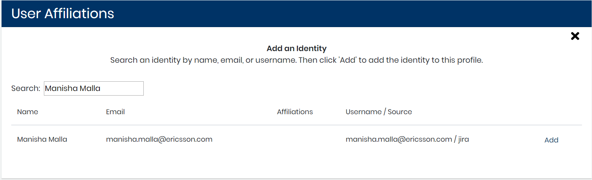
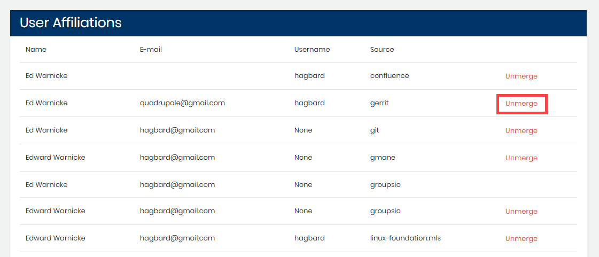

# Add or Unmerge a Profile Identity

A relational database maintains identities and related information that is automatically extracted from the software tools of your project. An identity is a record \(tuple\) composed of a name, email, username, and the name of the source from where it was extracted. Records are converted to unique identifiers. By default, all identities are considered as unique ones. Heuristics automatically merge identities based on perfect matches of unique identifier, name, email or username. When a match occurs, an identity is randomly selected as the unique one and the other identities are linked to it.

Each unique identity has a profile that summarizes the user data. The profile can be affiliated to more than one identity and you can add an identity to a profile. 

**Follow these steps:**

1. Select a **project name** of interest. 
2. Click **Affiliation Management**. 
3. Select a profile from **Top Unaffiliated Contributor** list or [search for a profile](find-a-profile.md). 
4. Click a **row** that corresponds to a name of interest. Profile Information appears. 
5. Go to **User Affiliations**. The profile identities are listed. Each identity shows Name, E-mail, Username, and Source. 
6. Continue to add or delete identity affiliations:
   1. [Add an Identity Affiliation](add-or-unmerge-a-profile-identity.md#add-a-profile-identity)
   2. [Unmerge a Profile Identity](add-or-unmerge-a-profile-identity.md#unmerge-a-profile-identity)

### Add a Profile Identity

An identity affiliation relates a profile with a unique identity.

**Follow these steps:**

1. Click **Add New**.  
The Add an Identity pane appears:

7. Enter a **name** or email in the Search field.  
Matching results appear.

8. Find the name you want to add and click **Add** on the row.

9. Click **X** to close the window.  
The added identity is listed in Profile Identities.

### Unmerge a Profile Identity

After you add a unique identity to a profile, the identity appears under Profile Affiliations.

Click **Unmerge**, and confirm ****to unmerge the unique identity from the user profile.

