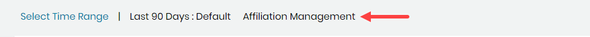

# View and Address the Top Unaffiliated Contributors

Top Unaffiliated Contributors list the top-ten respective items with the greatest numbers of contributions that have no affiliation. Addressing missing affiliations produces meaningful statistics about your contributors because individual contributions are not underestimated. Different roles \(examples: organization representatives, individual contributors, or community managers\) might recognize that contribution counts seem underestimated or inaccurate. These roles can take action by addressing missing affiliations.

**Do these steps:**

1. Click a **project** of interest on the home page.
2. Click **Affiliation Management**.

Affiliation Management shows:

* Top Unaffiliated Contributors—profiles with the greatest numbers of contributions that have no affiliation.

## Address Top Unaffiliated Contributors 

In Top Unaffiliated Contributors, look for a contributor who belongs to your project community. Missing affiliations for this contributor's profile might cause inaccurate counts for your project statistics.

**Do these steps:**

1. In Top Unaffiliated Contributor, click the name of the contributor or hover the mouse over the Count **number** for the contributor of interest and click **search**. The profile identities are listed. Each identity shows Name, Email, Affiliations, Bot, Country, Last Modified, and \# specifying the number of identities the person is affiliated with.
2. Look for a name that does not have an affiliation \(Affiliations is blank\) and click the **name**. Profile information for the name appears.
3. Continue to Step 5 in [Add an Identity to a Profile](add-an-identity-to-a-profile.md).
4. Select **Home** and scan Top Unaffiliated Contributors. The contributor name is no longer listed because you have addressed the missing affiliations.


Due to a lag in the list refresh, names can remain in a Top Unaffiliated list even after you have addressed the missing affiliation. Check the list again later.


