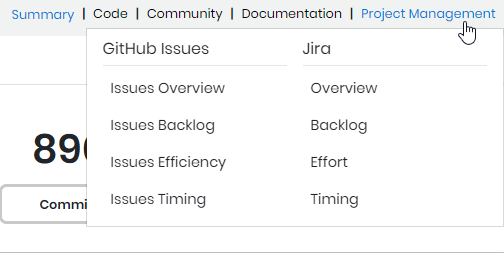

# Analyze Dashboard Analytics

INSIGHTS aggregates data and creates comprehensive dashboards from specific data sources. Dashboards include relevant visualizations that display analytic metrics and important data points. You can select and open a dashboard from drop-down lists corresponding to each data source.

* [Summary](../view-dashboard-catalog-of-a-project/summary.md)
* [Code](../view-dashboard-catalog-of-a-project/code/)
* [Community](../view-dashboard-catalog-of-a-project/community/)
* [Distribution](../view-dashboard-catalog-of-a-project/distribution/)
* [Documentation](../view-dashboard-catalog-of-a-project/documentation/)
* [Project Management](../view-dashboard-catalog-of-a-project/project-management/)
* [Technical Management](../view-dashboard-catalog-of-a-project/technical-management/)

A drop-down list is only available when a related data source is available. This example shows that the Code, Documentation, Community, and Project Management data sources are available whereas the Technical Management and Distribution data sources are not: 

**Follow these steps:**

1. From a project overview page, click a data source, for example Project Management.
2. Select a **dashboard** from the drop-down list:   The selected dashboard appears and shows relevant visualizations.

## Refine Your View 

* [Select Time Range](select-time-range.md)
* [Add and Manage Data Filters](add-and-manage-data-filters.md)
* [Use Visualization Options](use-visualization-options.md)
* [Change the Data Marker Color](change-the-data-marker-color.md)
* [Inspect the Data](inspect-the-data.md)

