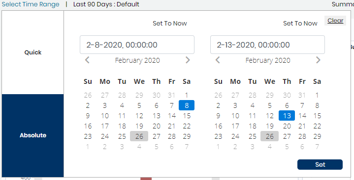
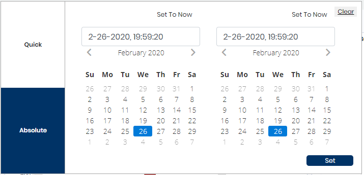

# Select Time Range

You can pick a time range to apply to all the data in an overview or dashboard. By default, the time range value is set to the Last 5 Years.

**Follow these steps:**

1. Open a project dashboard and click **Select Time Range**. The Time Range picker opens.    
2. Select a quick filter to apply a time range and a value: 
   * **Quick** shows preset time range values.
   * **Absolute** lets you enter the start date and end date in the MM-DD-YY, HH:MM:SS format. Click **Set** to see the project summary for the selected date and time. You can also:
     * click **Set To Now** to enter the current date and time, and click **Set** to see the project summary for the selected date and time.
     * click **Clear** to clear the set date and time. This shows the default value which is 90 days.

The data refreshes to match your time range selection, and the value you selected shows next to Time Range.

