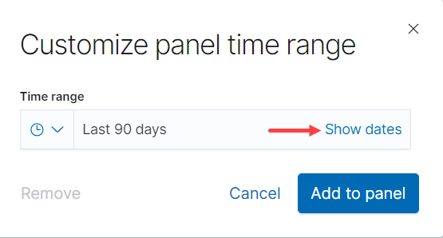
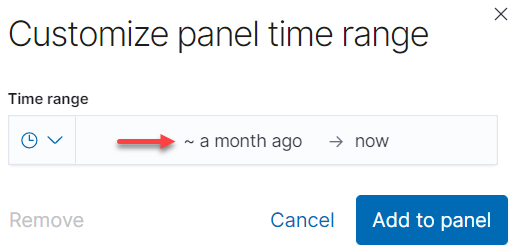
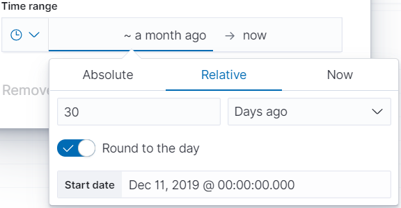
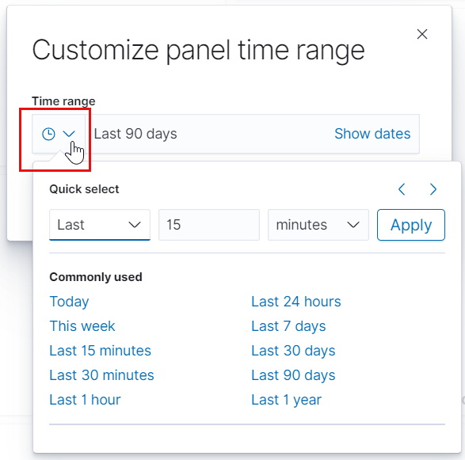
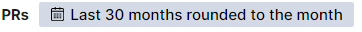

# Use Visualization Options

Useful options let you perform actions on a visualization, such as exporting data from a table. Visualizations provide an option where appropriate.

**Do these steps:**

1. Open a dashboard and then go to a visualization of interest.
2. Click a common **icon** or **item** as available to:

   <table>
     <thead>
       <tr>
         <th style="text-align:left">Icon</th>
         <th style="text-align:left">Description</th>
       </tr>
     </thead>
     <tbody>
       <tr>
         <td style="text-align:left">
           
         </td>
         <td style="text-align:left">
           
Options:

           
<b>Inspect</b>: Inspects data for the visualization.
              <b>Customize time range</b>: Lets you select a time range and add it to
             the panel. Click <b>Show dates </b>and the time range to open the time range
             picker for the visualization. Relative lets you enter the relative start
             time. You can specify the relative start time as any number of seconds,
             minutes, hours, days, months, or years ago. You can click the <b>Round to the &lt;time&gt; </b>key
             to set the exact time. After you click <b>Add to panel</b>, the timeline
             is added to the visualization panel, as shown below.

           

             
             
             
           

           

             
           

           

             
           

           
<b>Full screen</b>: Expands a visualization to full screen.

         </td>
       </tr>
       <tr>
         <td style="text-align:left">
           
         </td>
         <td style="text-align:left">Toggles the list view</td>
       </tr>
       <tr>
         <td style="text-align:left">
           
         </td>
         <td style="text-align:left">Show and hide a legend.</td>
       </tr>
       <tr>
         <td style="text-align:left">
           
         </td>
         <td style="text-align:left">Sort the column data in ascending or descending order.</td>
       </tr>
       <tr>
         <td style="text-align:left">
           
         </td>
         <td style="text-align:left">
           
Export and download data to a Comma-Separated Values (CSV) file.

           <ul>
             <li><b>Raw</b> downloads the data as provided: dates are timestamps, numbers
               do not have a thousand separator, and so on.</li>
             <li><b>Formatted</b> downloads the data in table format.</li>
           </ul>
         </td>
       </tr>
       <tr>
         <td style="text-align:left">
           
         </td>
         <td style="text-align:left">Open the corresponding URL.</td>
       </tr>
       <tr>
         <td style="text-align:left">
           

             
           

           

             
           

         </td>
         <td style="text-align:left">Eliminate data by clicking the corresponding legend <b>caption</b> (in this
           example <b>Contributors</b> or <b>Thursday</b>). Click the <b>caption</b> again
           to include the data.</td>
       </tr>
     </tbody>
   </table>

