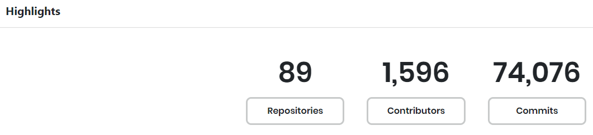
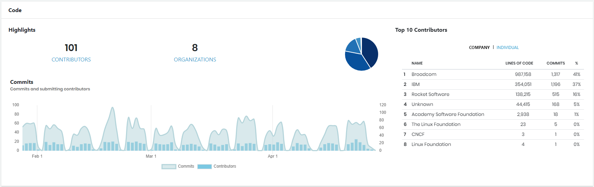
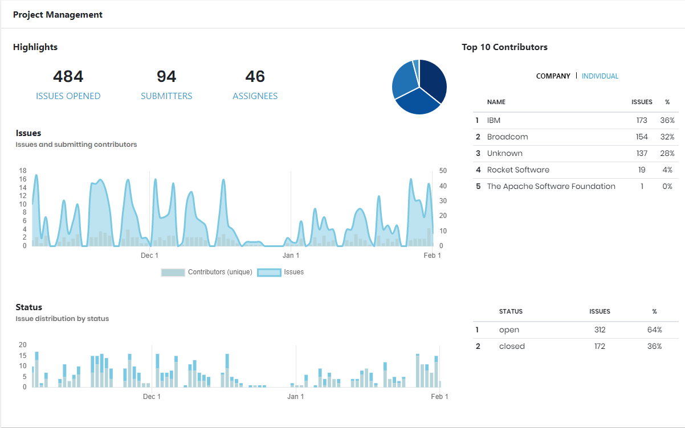
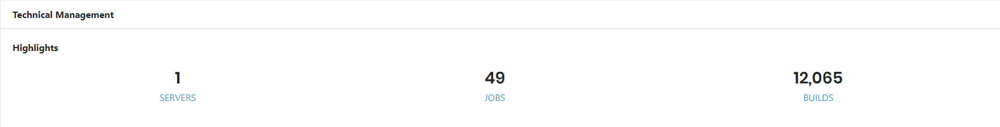
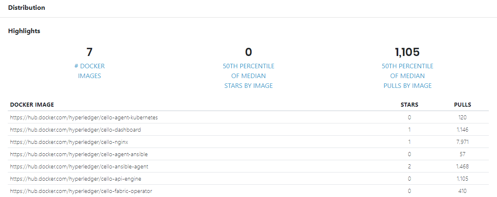

# Summary

Summary provides a high-level metrics about each data source for which the project is configured. Following are examples of some data sources:

**Highlights** shows the total number of repositories, contributors, and commits for the project.View an example of Highlights section

**Code** shows overview analytics about project commits and contributors:

* **Highlights** shows the number of contributors and organizations associated with the project.
* **Commits** shows a stacked area chart that compares the number of commits and contributors per calendar period. The total number of commits and contributor values are color-coded. Hover mouse over the graph to see the numbers for a particular date. Click **Commits** or **Contributors** to eliminate the corresponding data, for example: . Click the caption again to include the data.
* **Top 10 Contributors** lists the top-ten contributors—Individuals and Organizations— to the project by name, total number of lines of codes that includes lines of codes added plus modified, number of commits, and percentage of commits w.r.t to the total number of commits by the entire community. This percentage calculation does not include empty commits and commits by bot. Click **COMPANY** or **INDIVIDUAL** to show the corresponding commit data.  A pie chart shows proportional data for the total number of commits per company or individual as a slice of the pie. The pie chart data corresponds to your Contributors selection: COMPANY or INDIVIDUAL. 

Mouse over a slice to show the number of commits and the company or individual name.

Following is an example of code overview section:

**Project Management** shows overview analytics about issues, their statuses, and contributors:

* **Highlights** shows the number of opened issues, submitters, and assignees of the project.
* **Top 10 Contributors** lists the top-ten contributors—Individuals and Organizations— to the project by name, number of issues submitted, and percentage of open issues w.r.t to the total number of open issues associated with the community. Click **COMPANY** or **INDIVIDUAL** to show the corresponding issue data. A pie chart shows proportional data for the total number of issues per company or individual as a slice of the pie. The pie chart data corresponds to your Contributors selection: COMPANY or INDIVIDUAL. Mouse over a slice to show the number of issues and the company or individual name.
* **Issues** shows a stacked area chart that compares the number of issues and unique contributors per calendar period. The number of issues and unique contributors for the project during each period are color-coded. Click **Contributors \(unique\)** or **Issues** to eliminate the corresponding data, for example: . Click the caption again to include the data.
* **Status** shows a stacked bar graph that compares the number of issues per calendar period. A corresponding table summarizes the issues by status and shows the total number of issues and the percentage of the total issues for each status. The issue statuses are color-coded. Mouse over a color bar in the Status stacked bar graph to show the date, time, and number of issues. Following example shows the statuses as open and closed.  

Following an example of Project Management overview section:

**Technical Management** shows an overview analytics about the number of servers, jobs, and build numbers.View an example of Distribution overview section

**Distribution** shows overview analytics about container images of the project. This includes total number of container images, image links, number of starts and pulls for the project, and 50th percentile of median starts and pulls by image.View an example of Distribution overview section

