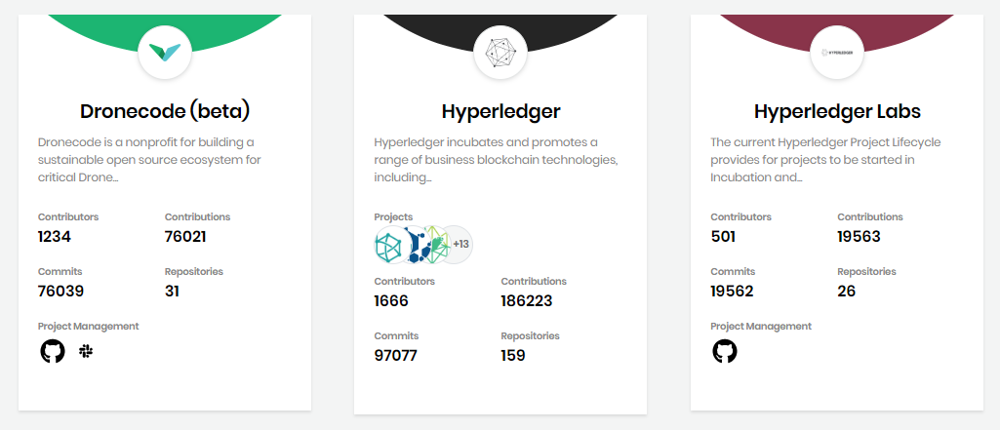
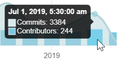
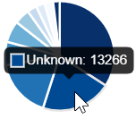

# View Project Details

Dev Analytics shows projects to which you have access on the Linux Foundation platform. The Projects page includes projects that are members of the Linux Foundation and of other foundations such as the Cloud Native Computing Foundation.

**Follow these steps:**

1. Open [https://lfanalytics.io](https://lfanalytics.io/). The Projects page appears and lists the projects to which you have access.
2. Navigate to a project card on the page . Each project card shows the following information:
   * Project name identifies the project by name.
   * Description briefly describes the project. When a project description shows only an excerpt, click the **excerpt** to see the entire description.
   * **Contributors** shows the total number of contributors to the project.
   * **Contributions** shows the total number of contributions to the project.
   * **Commits** shows the total number of commits to the project.
   * **Repositories** shows the total number of repositories created for the project.

     Some or all of the following information displays depending on what data is available:

     * **Projects** shows the logos for foundation member projects.
     * **Project Management** shows the logos of the data sources such as  for GitHub or Gerrit,  for Jira, or  for Slack .
     * Labels identify the project repository subjects.
     * An icon  on each Cloud Native Computing Foundation \(CNCF\) project indicates its [maturity stages](https://www.cncf.io/projects/): sandbox, incubating, or graduated.
3. Select a **project** of interest:
   * A foundation member project shows sub-projects. Select a **sub-project**. A page shows overviews.
   * A nonmember project shows a page with overviews.
4. Go to each overview. Overviews are dashboards that show important data. These overview dashboards are collection of charts and graphs that show you the metrics. The overview dashboards let you monitor many metrics at once, so you can check the health of your projects and see how the contribution is. For details, see [Summary](view-dashboard-catalog-of-a-project/summary.md).
5. Use optional actions:
   * [Select Time Range](view-dashboard-analytics/select-time-range.md)
   * Eliminate data by clicking the corresponding legend **caption** \(in this example **Contributors\)**. Click the **caption** again to include the data.  
   * Mouse over a color in a chart or graph to see details about the item.  

