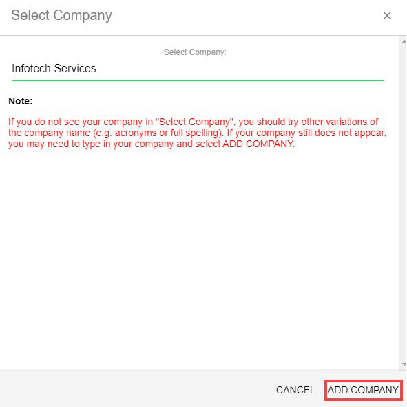

# Add a Company to a Project

As a CCLA manager, you use the CLA Corporate Console to add your company to a project.

_If you are also the project manager, make sure that you are logged out of the CLA Management Console before you begin using the CLA Corporate Console._

**Do these steps**:

1. ​[Sign in](sign-in-to-the-cla-corporate-console.md).

   The CLA Corporate Console appears and shows Companies.

2. Click **GET STARTED**.

   The Select Company dialog appears.  
     

3. Type a company's name in the dialog fields and click **ADD COMPANY**.

   ​​ 

   The Companies page shows your company.

4. Sign out or continue to [Sign a CCLA on Behalf of a Company](sign-a-corporate-cla-on-behalf-of-the-company.md) \(CCLA signatory\).

