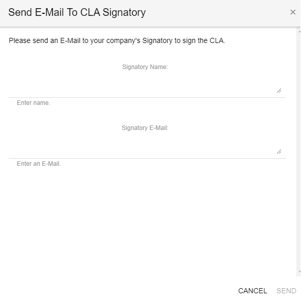

# Sign a Corporate CLA on Behalf of a Company

As a CCLA signatory, you must be authorized by your company to sign a Corporate CLA on its behalf. If you are a CCLA manager but not a CCLA signatory, you can request that the CCLA signatory sign the Corporate CLA.

**Do these steps:**

1. [Sign in](sign-in-to-the-cla-corporate-console.md).

The CLA Corporate Console appears and shows Companies.

2. Click the company for which you want to sign a Corporate CLA.  
The page displays projects with signed CLAs, pending requests to sign CLA, and sign new CLA sections. 

3. Click **SIGN** **NEW CLA**.

4. Select a project for which you want to sign CCLA, and click **SUBMIT**.

A CLA Signing Requirement dialog appears:

5. Click **YES** or **NO** according to your permissions:

* [YES](sign-a-corporate-cla-on-behalf-of-the-company.md#yes)
* [NO](sign-a-corporate-cla-on-behalf-of-the-company.md#no)

## YES 

The Corporate CLA dialog opens.

1. Click **OPEN CLA**.
2. Follow the instructions that DocuSign presents. Sign the document, and click **FINISH**. Some fields are pre-populated such as the company name and email.

Signed CCLA appears under **Projects with Signed CLAs**. If it doesn't appear, wait for some seconds or refresh the page.

## NO 

The **Send E-Mail To CLA Signatory** form appears. The Signatory Name and Signatory E-Mail fields may be pre-populated; if not complete the fields. Click **SEND**.

​[The CCLA signatory receives a CLA Sign Request](review-and-sign-a-corporate-cla-by-request.md) email, reviews and signs the document.

After the Corporate CLA is signed, the Company page shows the signed Corporate CLA under Signed Project CCLAs. You receive a CLA Signed Document email with an attached document PDF. Contributors to the company project simply need to confirm their association to the company, and then they can continue with their pull requests. Their subsequent contributions will not require association confirmations.


_A Corporate CLA that is signed by the CCLA signatory remains in effect even when that CCLA signatory is no longer employed at a company._


