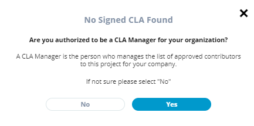

# Sign a Corporate CLA on behalf of the Company

As a CLA manager designee or CLA signatory, you must be authorized by your company to sign a Corporate CLA on its behalf.

**Do these steps:**

1. [Sign in](sign-in-to-the-cla-corporate-console.md) to the corporate console as a CLA manager.  
The CLA Corporate Console appears and shows the projects.

2. Navigate to the project for which you are  identified as the initial CLA manager and want to sign CLA. The following screen is displayed under EasyCLA tab:

, click **Start the CLA process**.

3.  On **No Signed CLA Found** window, click an answer: **Are you authorized to be a CLA Manager for your organization?**   
  

* **Yes**— A **Configuring CLA Manager Settings** window appears. After the configuration is complete, click **Proceed**, and continue to step 5.    
* **No**— An **Identify CLA Manager** form appears. Continue to next step.

4. Complete the form, and click **Submit Request**, Or click **Contact Company Admin**.   
****A window appears confirming that request is submitted to respective individual.

Click an answer: **Are you authorized to sign CLAs on your company's behalf?**  
  

* **Yes**— **Review CCLA** window appears. Click **Review & Sign CCLA**, and continue to step 5.  **** 
* **No**— An **Identify Authorized Signatory** form appears. Continue to next step.   

4. Complete the form, and click **Send Signature Request Email**.  
**Result:** A success window appears confirming that the signature request is sent to the email address of the individual who signs the Corporate CLA, and adds you to the approved list.


You will receive an email after you are added to the approved list. After you are added, you [acknowledge the company contribution](../contributors/contribute-to-a-corporate-github-project.md#if-you-are-added-to-the-approved-list) and/or [sign ICLA](../contributors/contribute-to-a-corporate-github-project.md#if-you-are-asked-to-sign-icla) before you can contribute to the project.


5. **Preparing CCLA** window appears. After CCLA preparation is completed, click **SIGN CCLA** on CCLA Ready for Signature window.  
**Result:** You will be redirected to complete the DocuSign process.

5. Select the checkbox, click **CONTINUE**,  and follow the instructions in the DocuSign document, sign it, and click **FINISH**.


* You receive an email from The Linux Foundation, informing you that you have signed the CLA. 
* You can download the PDF document by clicking the link form the email. You will be re-directed to Linux Foundation's website. If the download doesn't start automatically, click **Proceed to Download**.   


**Result:** You will be redirected to the project page, and your name and email address appear under **CLA MANAGERS FROM MY ORGANIZATION**. Following is an example:

