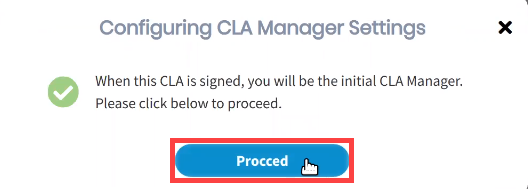

# Sign Corporate CLA for a Company

As a CLA manager you must be sign a Corporate CLA before you can add other CLA managers, approve contributors, and do management tasks.

**Do these steps:**

1. [Sign in](../cla-manager-designee/sign-in-to-the-cla-corporate-console.md) to the corporate console as a CLA manager designee.  
The CLA Corporate Console appears and shows the projects.

2. Navigate to the EasyCLA tab of project for which you are want to sign CLA, abd click **Start the CLA Process**.

3. Click an answer: **Are you authorized to be a CLA Manager for your organization?**  
  

* **Yes**— A **Configuring CLA Manager Settings** window appears. After configuration is complete, click **Proceed**, and continue to step 5.   
* **No**— An **Identify CLA Manager** form appears. Continue to next step.   

4. Complete the form, and click **Submit Request**, Or click **Contact Company Admin**.  
****A window appears confirming that request is submitted to respective individual.

5. You are designated as the initial CLA manager. Under **Action** column, click **Proceed with Signing**.  
**Result:** Identify CLA Signatory window appears.

5. Click an answer: **Are you authorized to sign CLAs on your company's behalf?**  
  

* **Yes**— **Review CCLA** window appears. Click **Review & Sign CCLA**, and continue to step 5.  **** 
* **No**— An **Identify Authorized Signatory** form appears. Continue to next step.   

4. Complete the form, and click **Send Signature Request Email**.  
**Result:** A success window appears confirming that the signature request is sent to the email address of the individual who signs the Corporate CLA, and adds you to the approved list.

5. **Preparing CCLA** window appears. After CCLA preparation is completed, click **SIGN CCLA** on CCLA Ready for Signature window.  
**Result:** You will be redirected to complete the DocuSign process.

5. Select the checkbox, click **CONTINUE**,  and follow the instructions in the DocuSign document, sign it, and click **FINISH**.


* You receive an email from The Linux Foundation, informing you that you have signed the CLA. 
* You can download the PDF document by clicking the link form the email. You will be re-directed to Linux Foundation's website. If the download doesn't start automatically, click **Proceed to Download**.   


**Result:** You will be redirected to the project page, and your name and email address appear under **CLA MANAGERS FROM MY ORGANIZATION**. Following is an example:

