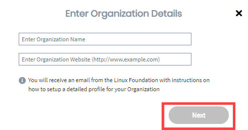
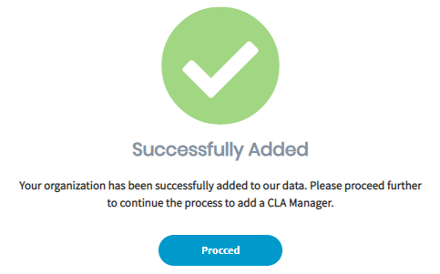

# Contribute to a Corporate Gerrit Project

As an individual contributor or a corporate \(employee\) contributor or to an open source project, you submit changed code in Gerrit to inform reviewers about the changes:

* As an individual contributor to an open-source project who is not associated to a company, you submit code in Gerrit and during the process, your CLA is verified. Also during the process, you click a link to open the CLA Contributor Console to sign the CLA Agreement. As an individual contributor, your work is owned by yourself \(Individual CLA\).
* If any of your contributions to the project are created as part of your employment, the work may not belong to you—it may be owned by your employer. In that case, the CCLA signatory represents the employer \(company\) for legal reasons, and signs the Corporate Contributor Licensing Agreement in order for your contribution to be accepted into the company. During the code submission process, your CLA status is verified.

  When all CLA management set-up tasks are complete and your CCLA signatory has signed a Corporate CLA, you simply confirm your association to the company during your first code submission. Then, you can continue. Your subsequent contributions will not require association confirmations.

**Do these steps:**

_If you are a project manager, make sure that you are logged out of the CLA Management Console before you begin._

1. In Gerrit, clone a repository under the Gerrit instance into your local machine.

2. Make a change and push the code to your Gerrit repository.

3. A warning link that you need to sign a CLA appears:

4. Navigate to the Gerrit instance of your project. For example, if you are contributing to OPNFV project, navigate to [https://gerrit.opnfv.org](https://gerrit.opnfv.org/)​

5. Sign in using your [Single Sign-On \(SSO\)](../../../sso/) account.

6. Navigate to **Settings**— the gear icon on the upper right corner, and click **Agreements** from the menu on the left:

​​    ​​

7. Click **New Contributor Agreement**.

8. New Contributor Agreement types appear:

9. Continue to contribute as an individual or employee \(corporate contributor\):

* [Individual Contributor](contribute-to-a-corporate-gerrit-project.md#individual-contributor)
* [Corporate Contributor](contribute-to-a-corporate-gerrit-project.md#corporate-contributor)

## Individual Contributor 

EasyCLA presents a review agreement link to individual contributors to open a CLA and sign it.

1. Select an individual CLA type.

2. Click the **Please review the agreement link** and then click the message link that appears:

3. Sign in to EasyCLA if you are prompted.

The CLA Contributor Console appears and shows the CLA group for your project.  
**Note:** If the project has not configured for CCLA, then **Proceed as a Corporate Contributor** option is not displayed.

5. Click **Proceed as an Individual Contributor**.  
**Result: Preparing CLA..** window appears.  
  

 6. After **CLA is Ready For Signature** window appears, click **SIGN CLA** .

DocuSign presents the agreement that you must sign. The ICLA is not tied to any employer you may have, so enter your personal email address in the E-Mail field.

6. Select the checkbox, click **CONTINUE**,  and follow the instructions in the DocuSign document, sign it, and click **FINISH**.


**Result:**

* You receive an email from The Linux Foundation, informing you that you have signed the CLA. 
* You can download the PDF document by clicking the link form the email. You will be re-directed to Linux Foundation's website. If the download doesn't start automatically, click **Proceed to Download**.  


You are redirected to Gerrit. Wait a few seconds for the CLA status to update or refresh the page.

## Corporate Contributor 

EasyCLA presents a review agreement link where you confirm your association with the company.

1. Select **Corporate CLA**.

2. Click the **Please review the agreement link** and then click the message link that appears:

3. Sign in to EasyCLA if you are prompted.

6. Click **Proceed as a Corporate Contributor**.   
**Note:** To contribute to this project, you must be authorized under a signed Contributor License Agreement. You are contributing your work on behalf of a company.

7. On **Select Your Organization** window, type organization name in the filed, select the organization from the drop-down list, and click **Proceed**.

**Note:** If your company is not in the list, you can add the company as described in [If Company is not in the list](contribute-to-a-corporate-github-project.md#if-the-select-company-dialog-appears-1).

8. Continue:

* [If you are not added to the approved list](contribute-to-a-corporate-github-project.md#if-you-are-not-added-to-the-approved-list)
* [If you are added to the approved list](contribute-to-a-corporate-github-project.md#if-you-are-added-to-the-approved-list)
* [If you are asked to sign ICLA](contribute-to-a-corporate-github-project.md#if-you-are-asked-to-sign-icla)
* [If Company has not signed CLA](contribute-to-a-corporate-github-project.md#if-the-select-company-dialog-appears)
* [If Company is not in the List](contribute-to-a-corporate-github-project.md#if-the-select-company-dialog-appears-1)

## If you are not added to the approved list

If your company has signed CLA, but you are not added to the approved list, **Request Authorization to Contribute** window appears that shows the CLA manager\(s\) for your company.

1. Select CLA manager\(s\) from the drop-down list whom you want to request for authorizing you to contribute.

* **Go Back:** Takes you to the previous screen.
* **Exit EasyCLA:** Cancels the CLA signing process.

2. Click **Request Authorization**.  
A dialog appears and informs you: Request Submitted.

3. Click **Exit EasyCLA**.  
_****_The CLA  manager adds you to the approved list.


You will receive an email notification if the CLA manager approves or rejects your request to be approved as a corporate contributor for the company.


## If you are added to the approved list

1. An acknowledgement window appears informing you that you have completed the contribution acknowledgement.  
  

2. Click **Exit EasyCLA**.

You are redirected to GitHub. Wait a few seconds for the CLA status to update or refresh the page.

4. Click **Merge pull request** and confirm the merge.

## If you are asked to sign ICLA

1. If you are added to the approved list, but your CLA requires you to sign Individual CLA \(ICLA\),  the follwoing screen appears:  
  

2. Click **Proceed**.

3. On **CLA Ready For Signature** window, click **SIGN CLA**.  
  

4. Follow the instructions in the DocuSign document, sign it, and click **FINISH**.


* You receive an email from The Linux Foundation, informing you that you have signed the CLA. 
* You can download the PDF document by clicking the link form the email. You will be re-directed to Linux Foundation's website. If the download doesn't start automatically, click **Proceed to Download**.  


You are redirected to GitHub. Wait a few seconds for the CLA status to update. A tick appears next to your branch.

5. Click **Merger pull request**.

## If Company has not signed CLA 

If your company has not signed a CLA, **No Signed CLA Found** window appears.

1. Click an answer: **Are you authorized to be a CLA Manager for your organization?**

* [Yes](contribute-to-a-corporate-github-project.md#yes-if-you-are-authorized)
* [No](contribute-to-a-corporate-github-project.md#no-if-you-are-not-authorized)

### **Yes \(If you  are authorized\)**

1. A **Configuring CLA Manager Settings** window appears. 

2. After the configuration settings is completed, click **Proceed**.  
  


**Important:** If you don't have a username \(LFID\) associated with Linux Foundation, you will be re-directed to Linux Foundation page to create a username. After you create a username, you will be re-directed back to corporate console where you can proceed with CLA signing.


3. You will be redirected to [corporate.lfcla.com](https://corporate.lfcla.com/#/companies) to [sign a CLA]().

After you successfully sign a CCLA, you are redirected to GitHub. Wait a few seconds for the CLA status to update or refresh the page. A tick appears next to your branch. A notification appears:

4. Click **Merge pull request** and confirm the merge.

### **No \(If you are not authorized\)**

1. An **Identify CLA Manager** form appears.  
  

2. Complete the form, and click **Submit Request**, ****Or if you don't know email address of CLA Manager of your company, click **Contact Company Admin**.  
**Result:** A window appears confirming that request is submitted to respective individual who signs a Corporate CLA and adds you to the approved list.

3. Click **Exit EasyCLA**.  
You can contribute after the authorized representative signs a corporate CLA, and adds you to the approved list. 


You will receive an email after you are added to the approved list. After you are added, you [acknowledge the company contribution](contribute-to-a-corporate-github-project.md#if-you-are-added-to-the-approved-list) and/or [sign ICLA](contribute-to-a-corporate-github-project.md#if-you-are-asked-to-sign-icla) before you can contribute to the project.


## If Company is not in the List 

1. Click **+Click Here** next to **Organization not listed?**

2. ****Provide organization name and website URL on **Enter Organization Details** window, and click **Next**.

3. A window appears confirming that the organization is successfully added. Click **Proceed**, and continue to [step 1 of Company has not signed CLA](contribute-to-a-corporate-github-project.md#if-the-select-company-dialog-appears).  
**Note:**  if the company is already added to the list, **Company Already Exists** window appears. 

4. Click **Proceed** to [sign a corporate CLA](../cla-manager-designee-or-initial-cla-manager/sign-corporate-cla-for-a-company.md).

You have finished signing your CLA for this Gerrit instance. You are able to submit your changes to any repository under this Gerrit instance.

