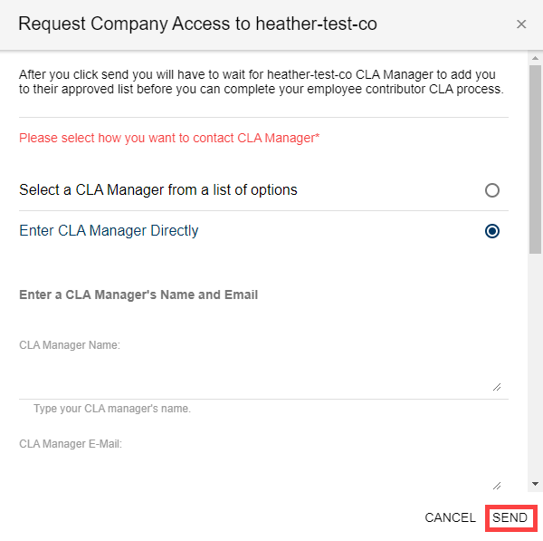

# Contribute to a GitHub Company Project

As a corporate \(employee\) contributor to an open-source project, you create a pull request in GitHub to inform code maintainers about changes made to the code. If any of your contributions to the project are created as part of your employment, the work may not belong to you—it may be owned by your employer. In that case, the CCLA signatory represents the employer \(company\) for legal reasons, and signs the Corporate Contributor Licensing Agreement in order for your contribution to be accepted into the company. During the pull request process, your CLA status is verified.

When all CLA management set-up tasks are complete and your CCLA signatory has signed a Corporate CLA, you simply confirm your association to the company during your first pull request. Then you can continue with your pull request. Your subsequent contributions will not require association confirmations.

**Do these steps:**

_If you are a project manager, make sure that you are logged out of the CLA Management Console before you begin._

1. In GitHub, go to the repository that is linked to the project for your organization.

2. Make a change and send a pull request.

3. EasyCLA checks the CLA status of all committers involved in that pull request. EasyCLA marks a cross or a tick beside contributor names involved in that pull request based on their CLA status.  
**Note:** A cross next to your contributor name means the CLA check failed.

4. Click **Please click here to be authorized**.  
**Note:** The Authorize CommunityBridge: EasyCLA dialog appears.

5. Click **Authorize LF-Engineering**. \(Subsequent contributions will not require authorization.\)

​​

6. The CLA Contributor Console appears and shows the CLA group for your project. One or more CLA types that you must sign display: Company and Individual.

7. Select **Company**.  
**Note:** To contribute to this project, you must be added to an approved list by the CLA manager under a signed Contributor License Agreement. You are contributing on behalf of your work for a company.

8. Continue:

* [If Confirmation of Association statement appears](contribute-to-a-github-company-project.md#if-confirmation-of-association-statement-appears)
* [If you are not added to the approved list](contribute-to-a-github-company-project.md#if-you-are-not-added-to-the-approved-list)
* [If your company has not signed CLA](contribute-to-a-github-company-project.md#if-your-company-has-not-signed-cla)
* [If your company is not in the list](contribute-to-a-github-company-project.md#if-your-company-is-not-in-the-list)

## If Confirmation of Association statement appears

This message appears if you are added to the approved list, and your CLA doesn't require you to sign ICLA. If the CLA is configured for you to sign ICLA, you will be re-directed to sign an Individual CLA, as shown in [step 5 of sign ICLA](sign-a-cla-as-an-individual-contributor-to-github.md).

1. Read the Confirmation of Association statement and select the checkbox.

2. Click **CONTINUE**.

A dialog appears and informs you: You are done!

3. Click **RETURN TO REPO**.

You are redirected to GitHub. Wait a few seconds for the CLA status to update or refresh the page.

## If you are not added to the approved list

You must be added to the approved list under a signed CCLA before you can contribute to the project.

**To contact your CLA manager to add you to the approved list:**

1. Click **CONTACT** under Contact the CLA Manager to be approved under their signed Corporate CLA.

2. Select an option, and complete the form.

3. Click **SEND**.  
A message appears informing you that the e-mail is sent successfully.


You will receive an email notification if the CLA manager approves or rejects your request to be approved as a corporate contributor for the company.


## If your company has not signed CLA

1. The **Verify Your Permission of Access** dialog appears.
2. Click an answer: Are You a CLA Manager?

   **YES**— You will be redirected to [corporate.lfcla.com](https://corporate.lfcla.com/#/companies) to [sign a CLA](../ccla-managers-and-ccla-signatories/sign-a-corporate-cla-on-behalf-of-the-company.md).

   **NO**— A Request Access form appears. Continue to next step.

3. Complete the form and click **SEND**.

   The CCLA manager signs a Corporate CLA and adds you to the approved list.

## If your company is not in the list

If you don't find your company's name in the list:

1. Click **COMPANY NOT IN LIST? CLICK HERE**.

   The **Verify Your Permission of Access** dialog appears.

2. Click an answer: Are You a CLA Manager?

   **YES**— You will be redirected to [corporate.lfcla.com](https://corporate.lfcla.com/#/companies) to [add your company](../ccla-managers-and-ccla-signatories/add-a-company-to-a-project.md) to a project.

   **NO**— A Request Access form appears. Continue to next step.

3. Complete the form and click **SEND**.

   The CCLA manager signs a Corporate CLA and adds you to the approved list.

