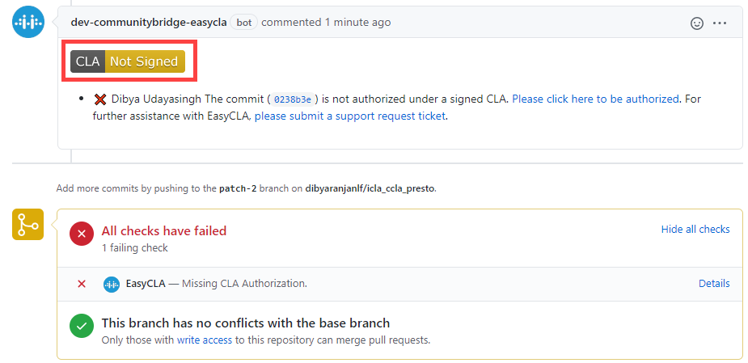
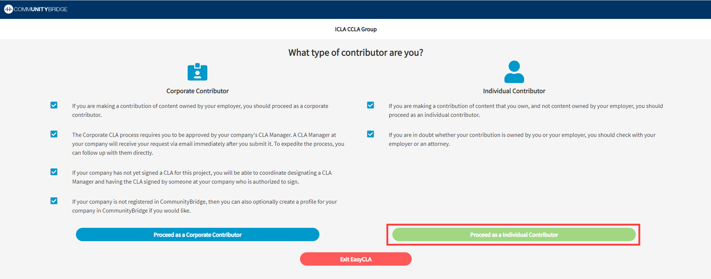

# Sign a CLA as an Individual Contributor to GitHub

As an individual contributor to an open-source project who is contributing code on your own behalf \(and not on behalf of an employer\), you create a pull request in GitHub to inform code maintainers about changes made to the code. During the pull request process, your CLA is verified. Also during the process, you click a link to open the CLA Contributor Console to sign the CLA.

**Do these steps:**

1. In GitHub, go to the repository that is linked to the project for your organization.

2. Make a change and send a pull request.


1. EasyCLA checks the CLA status of all committers involved in that pull request. EasyCLA marks a cross or a tick beside contributor names who are involved in that pull request based on their CLA status.
2. A cross next to your contributor name means the CLA check failed.


3. Click   or **Please click here to be authorized**.

The Authorize CommunityBridge: EasyCLA dialog appears.

4. Click **Authorize LF-Engineering**. \(Subsequent contributions will not require authorization.\)

​​

The CLA Contributor Console appears and shows the CLA group for your project.  
**Note:** If the project has not configured for CCLA, then Corporate Contributor option is not displayed.

5. Click **Proceed as a Individual Contributor** and then click **SIGN CLA** after CLA is ready for signature window appears.

DocuSign presents the agreement that you must sign. The ICLA is not tied to any employer you may have, so enter your personal email address in the E-Mail field.

6. Select the checkbox, click **CONTINUE**,  and follow the instructions in the DocuSign document, sign it, and click **FINISH**.

You are redirected to GitHub. Wait a few seconds for the CLA status to update. A tick appears next to your branch.

7. Click **Merge pull request** and confirm the merge.

The CLA is added to the project.

