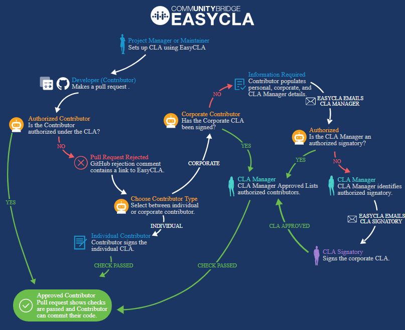

# Getting Started

## What is EasyCLA? 

_EasyCLA_ helps maintainers of open source projects streamline their workflows and reduce the hassle of managing Contributor License Agreements \(CLAs\) and authorizing contributors. By automating many of the manual processes, this open source solution hosted by the Linux Foundation reduces delays for developers to get authorized under a CLA.

## What is a CLA? 

A _Contributor License Agreement_ \(CLA\) defines the terms under which intellectual property is contributed to a company or project. Typically, the intellectual property is software under an open source license. EasyCLA helps to ensure that contributions are not pulled into a project unless a CLA covering the contributor has been signed. CLAs typically fall into one of two categories:

* **Corporate Contributor License Agreement**

  If the company \(employer\) owns the contribution, a CCLA signatory signs a Corporate CLA. The Corporate CLA legally binds the corporation, so the agreement must be signed by a person with authority to enter into legal contracts on behalf of the corporation. A Corporate CLA may not remove the need for every employee \(developer\) to sign their own Individual CLA -- which separately covers contributions owned by the individual contributor -- if the project requires this.

* **Individual Contributor License Agreement**

  If as an individual you own the contribution, you sign the Individual CLA. A signed Individual CLA may be required before an individual's contribution can be merged into the project repository.

## How Does it Work? 

This high-level diagram shows the different flows and roles that EasyCLA supports:

## What Role are You? 

How you interact with EasyCLA depends on your role. EasyCLA supports the following roles in its workflow:

* [Project Manager](./#project-manager)
* [Contributor](./#contributor)
* [Corporate CLA \(CCLA\) manager](./#corporate-cla-manager)
* [Corporate CLA \(CCLA\) manager designee](./#corporate-cla-manager-designee)
* [Corporate CLA \(CCLA\) signatory](./#corporate-cla-signatory-1)

### Project Manager 

You are a _project manager_  or _project admin_ if you are authorized by Linux Foundation to maintain project\(s\). You use the project console on admin dashboard where you have access to specific projects as per the permission provided by Linux Foundation. You can set up project details and perform other activities as described in **A LINK WILL BE GIVEN TO ADMIN DASHBOARD ONCE THAT IS READY.** You can perform the following activities ****within the EasyCLA service:

1. [Add a New CLA Group](../project-managers/add-new-cla-group.md)
2. [Add or Remove Project from CLA Group](../project-managers/add-or-remove-a-project-from-cla-group.md)
3. [Add](../project-managers/add-and-manage-git-organizations-and-repositories/#add-github-organization) or [Disassociate](../project-managers/add-and-manage-git-organizations-and-repositories/#disassociate-github-organization) GitHub Organization
4. [Add](../project-managers/add-and-manage-git-organizations-and-repositories/#add-gerrit-organization) or [Disassociate](../project-managers/add-and-manage-git-organizations-and-repositories/#disassociate-gerrit-organization) Gerrit Organization 
5. [Add GitHub repositories](../project-managers/add-and-manage-git-organizations-and-repositories/add-or-remove-git-repositories-for-cla-monitoring.md) to enforce CLA monitoring
6. [Uninstall the EasyCLA Application](../project-managers/add-and-manage-git-organizations-and-repositories/uninstall-the-easycla-application.md)

At any time, you can do other management tasks:

* [View Signed CLA Documents](../project-managers/view-and-manage-signed-clas-for-a-cla-group.md#view-signed-cla-document)
* [View Signed Individual CLAs \(ICLAs\)](../project-managers/view-and-manage-signed-clas-for-a-cla-group.md#view-signed-individual-clas-iclas)
* [View Signed Corporate CLAs \(CCLAs\)](../project-managers/view-and-manage-signed-clas-for-a-cla-group.md#view-signed-corporate-clas-cclas)
* [View CLA managers of the company](../project-managers/view-and-manage-signed-clas-for-a-cla-group.md#view-cla-managers-of-the-company)
* [View approval criteria for corporate contributors](../project-managers/view-and-manage-signed-clas-for-a-cla-group.md#view-approval-criteria)
* [View approved contributors of the company](../project-managers/view-and-manage-signed-clas-for-a-cla-group.md#view-approved-contributors)
* [View Connection Status of Git Organizations and Repositories](../project-managers/add-and-manage-git-organizations-and-repositories/view-connection-status-of-git-organizations-and-repositories.md)

### Contributor 

You are a _contributor_ \(developer\) if you contribute code to GitHub or Gerrit projects. With EasyCLA, you will follow different workflows depending on whether the project is hosted on GitHub or Gerrit, and whether you contribute on behalf of a company or yourself as an individual:

* **Corporate** **Contributor \(GitHub\):** [confirm your association with a company](../contributors/corporate-contributor.md) that has a signed Corporate Contributor License Agreement.
* **Individual** **Contributor \(GitHub\):** [sign an Individual Contributor License Agreement](../contributors/individual-contributor.md).
* **Corporate** **Contributor \(Gerrit\):** [confirm your association with a company](../contributors/contribute-to-a-corporate-gerrit-project.md) that has a signed Corporate Contributor License Agreement.
* **Individual Contributor \(Gerrit\):**[ sign an Individual Contributor License Agreement](../contributors/contribute-to-a-corporate-gerrit-project.md).

### Corporate CLA Manager 

You are a _Corporate CLA manager_ \(CCLA manager\) if you are the person authorized to manage the list of approved contributors under your company’s Corporate CLA. There can be one or more CLA managers for a company. With this responsibility, you use EasyCLA to:

* [Add Contributors to Approved List](../cla-managers/add-and-manage-contributors.md)
* [Add or Delete CLA Managers](../cla-managers/add-or-delete-cla-managers.md)

### Corporate CLA Manager Designee

You are a _Corporate CLA Manager Designee_ \(CCLA manager designee\) if there are no existing CLA managers for a company, and  you are the first person to sign a CLA for a project.

You become a CLA manager designee:

* When you are authorized to [sign CLA](../cla-manager-designee-or-initial-cla-manager/sign-corporate-cla-for-a-company.md) for a company as an initial CLA manager. After you sign CLA, you become [CLA manager](../cla-managers/). 
* When you receive an email informing you that you are identified as a CLA manager for a project. You [sign the CLA](../cla-manager-designee-or-initial-cla-manager/sign-corporate-cla-from-invitation.md), and become CLA manager. You must have an LF ID to sign the CLA.

### Corporate CLA Signatory 

You are a _Corporate CLA signatory_ \(CCLA signatory\) if you are authorized to sign contracts, such as [review and sign the project’s CLA on behalf of the company](../cla-signatories/review-and-sign-a-corporate-cla-by-request.md). As a signatory, you must have legal authority to sign documents on behalf of the company. 

