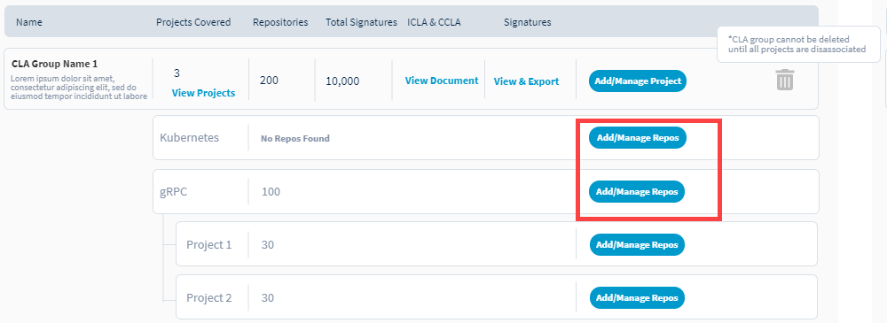

# Add or Remove Git Repositories for CLA Monitoring

Before you enable Git repositories for CLA monitoring or remove them from CLA monitoring, you must add the Git organizations— [add GitHub organization](./#add-github-organization) or [add Gerrit organization](./#add-gerrit-organization). You can perform the following activities with EasyCLA:

1. [Sign in](../sign-in-to-project-console.md).

2.Click a **project** of interest.  
The project page appears.

3. Navigate to **Product Services** tab, and click **CLA**.

3. Under a CLA group, click **Add/Manage Repos** for a project.  
Source Control configuration page appears.

4. 

