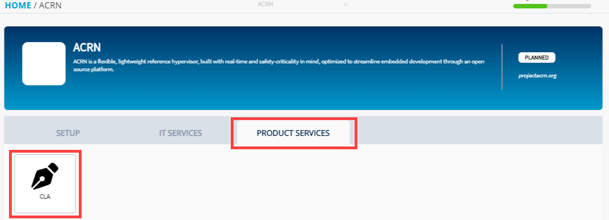

# Add New CLA Group

A CLA group defines:

* What CLA types your project requires for pull requests or push submissions—the agreement types are for corporate or individual CLAs
* What CLAs and their versions are used for the contributors
* What GitHub repositories, Gerrit instances, or both enforce CLA monitoring

As a project manager, you use the CLA Management Console to add and name a CLA group for your project. A CLA group gives you the flexibility to handle different CLA requirements for various GitHub repositories and Gerrit instances. After you add a new CLA group, you must [configure the repositories to enforce CLA monitoring]().

**Do these steps:**

1. [Sign in](sign-in-to-project-console.md).

2. Click a project of interest.  
The project page appears.

3. From **Product Services** tab, and click **CLA**.  
The CLA overview page appears.

4. Click **+Add New CLA Group**.

5. Under CLA Group Name tab, provide a CLA group name, and description in the respective fields.  
**Note:** Click the **Help** icons to know more about a filed or check box.

6. Select the check boxes as applicable to contributors of project, and click **Next**.


* A warning message appears if you select only one.
* If you select **Corporate CLA**, only corporate employees can sign and contribute to your project.
* If you select **Individual CLA,** only individuals can sign and contribute to your project.


  7. Under **Edit/Review Template** tab, enter details in **Project Full Entity Name** and **Email Address of Person Managing Project** fields.

8. Click **Review CCLA Template** and **Review ICLA Template** to view the templates, and then click **Approve Template & Download**.

* **For an Individual Project:** CLA group is added for the project.
* **For a Project Group: Select Projects** tab appears. Continue to next step.


**Important:** If you log out at this stage, you will loose all the details that you have provided.


9. Under **Select Projects** tab, select the projects that you want to enroll under the CLA group, and click **Finish.  
Result:** The CLA group is configured for the project.  
**Note:** **Select all Projects** allows you to select all the projects at a time.


**Important:** After a project is added, you cannot remove a project from the CLA group.


Connecting your GitHub organization will let you enable EasyCLA checks on that organization. If you already have a CLA process in place, go to [https://cloud.email.thelinuxfoundation.org/EasyCLA](https://cloud.email.thelinuxfoundation.org/EasyCLA) and file a ticket to describe your particular needs, and import your existing CLAs.

4. Enter your organization name in the GitHub Organization URL field. The URL automatically appends the name. Click **CONNECT**.

**Result:** The Connect LF CLA App to GitHub Organization dialog appears.

The GitHub organization name value is case-sensitive—make sure that the name you enter matches the case of your GitHub organization name exactly.

5. Read the instructions and click **INSTALL THE GITHUB CLA APP**.  
​The EasyCLA Application opens in GitHub

6. Click **Install** on the EasyCLA Application.

7. Select one or more repositories and assign permissions. Click **Install**.

The CLA Management Console appears and the GitHub Organizations pane shows the organizations and the repositories that the EasyCLA Application is authorized to monitor.


* _To delete an organization from monitoring, click **DELETE** next to the organization that you want to delete. A confirmation dialog appears. Click **DELETE**. You must also_ [_Uninstall LF CLA Application for Your Organization_](add-and-manage-git-organizations-and-repositories/uninstall-the-easycla-application.md) _that you installed in Step 5._
* A message informs you that your project needs a CLA group. A CLA group defines one or more CLA types that contributors must sign.
* If the EasyCLA Application is not connected to GitHub properly, an error message appears under the organization name: Not Configured. Please connect the CLA App to the Github Org. Click the **message link** to return to Step 4.


8. Repeat Steps 2 through 7 to connect as many organizations as you want.


**Important:** _To enable a CLA check on a repository, you must configure a GitHub repository or add a Gerrit instance. Simply adding an organization to the project does not enable the CLA check for any CLA groups._


### Next Steps:

* [Add a CLA Group]()
* [Add GitHub Repositories to CLA Monitoring or Remove Them From CLA Monitoring]()

  or

* [Add Gerrit Instances to CLA Monitoring or Delete Them From CLA Monitoring]()

