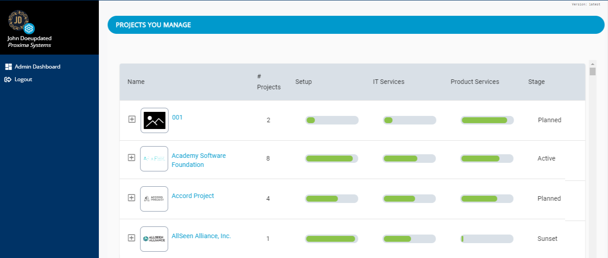

# Sign in to Project Console

You sign in to the CLA project console of Admin Dashboard to perform the CLA set-up and management tasks for projects that you manage.

**Do these steps: \(PRANAB TO CHECK THE USER FLOW\)**

1. Go to [https://project.lfcla.com](https://project.lfcla.com). **\(IS THIS LINK CORRECT? PRANAB TO CONFIRM\)**

2. Click **SIGN IN**. The LF CLA sign-in dialog appears.

3. Enter your credentials as the project manager and click **Sign In**.  
**Result:** The Admin Dashboard appears and lists projects that you manage:

4. Click a project to view more about the project. For details, see [View Project CLA Details](view-cla-details.md).

