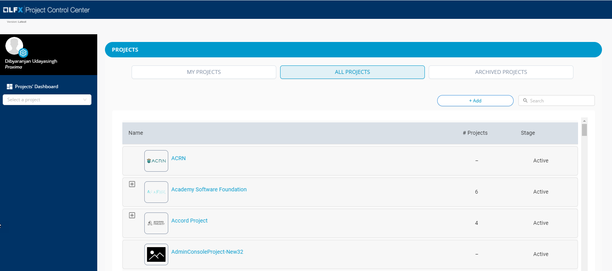

# Sign in to Project Control Center

You sign in to the CLA project control center to perform the CLA set-up and management tasks for projects that you manage.

**To Sign in:**

1. Go to [https://admin.dev.platform.linuxfoundation.org/](https://admin.dev.platform.linuxfoundation.org/).

2. Click **Sign in with SSO**.

3. Enter your credentials as the project manager and click **Sign In**.

4. Click a project to view more about the project. For details, see [View Project CLA Details](view-cla-details.md).

