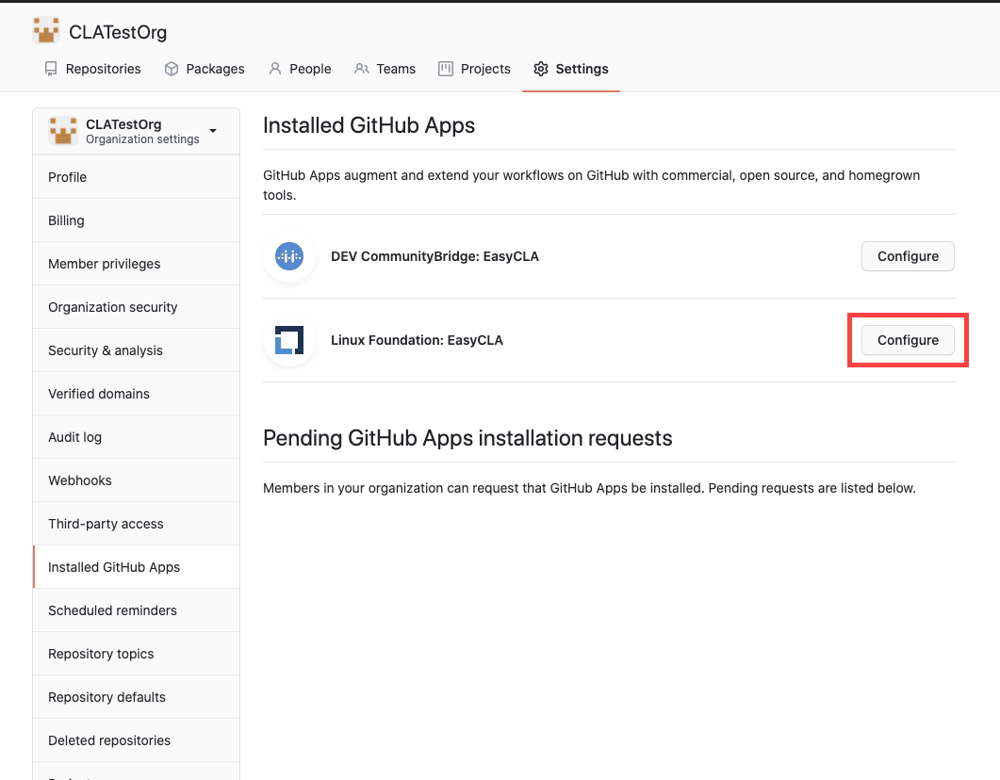

# Uninstall the EasyCLA Application

As a project manager, you can uninstall the EasyCLA Application for a GitHub organization. When you uninstall the app, it is removed from all your repositories. CLA monitoring is no longer in effect.

**To Uninstall:**

1. Sign in to GitHub, and navigate to the organization for which you want to uninstall the EasyCLA application.

2. Under **Settings** tab, select **Installed GitHub** Apps from the left side navigation pane.

3. Click **Configure** for the Linux Foundation: EasyCLA app.

4. Navigate to **Danger zone &gt; Uninstall Linux Foundation: EasyCLA** section, and click **Uninstall**.

5. Refresh the CLA Management Console.

The EasyCLA Application is uninstalled.

