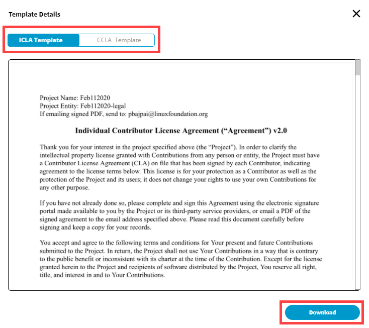
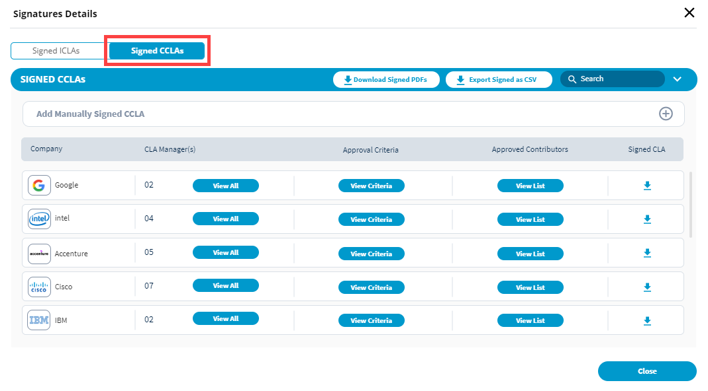
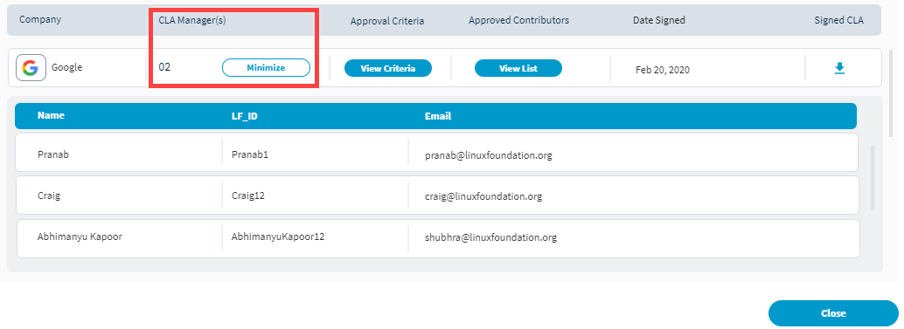

# View and Manage Signed CLAs for a CLA Group

You can view details, such as user signatures, companies, CLA managers, and so on for a signed CLA. For companies that have signed CLA manually, you can also add those under a CLA group.

**Do these steps:**

1. [Sign in](sign-in-to-project-console.md).
2. Click a **project** of interest.

   The project page appears.

3. Navigate to **Product Services &gt; CLA**.
4. Do any of the following actions:
   * [View Signed CLA Documents](view-and-manage-signed-clas-for-a-cla-group.md#view-signed-cla-document)
   * [View CLA User Signatures](view-and-manage-signed-clas-for-a-cla-group.md#view-cla-user-signatures)
   * [View the Corporate CLA Companies](view-and-manage-signed-clas-for-a-cla-group.md#view-corporate-cla-companies)
   * [View CLA managers of the company](view-and-manage-signed-clas-for-a-cla-group.md#view-cla-managers-of-the-company)
   * [View approval criteria for corporate contributors](view-and-manage-signed-clas-for-a-cla-group.md#view-approval-criteria)
   * [View approved contributors of the company](view-and-manage-signed-clas-for-a-cla-group.md#view-approved-contributors)

## View Signed CLA Document

Under ICLA & CCLA, click **View Document**. Template Details shows the signed CLA documents.

Template details shows and lets you download the signed documents. Navigate to CCLA Template tab to view and download CLA signed by companies.

## View CLA User Signatures

Under Signatures, click **View & Export**.

**Signed ICLAs** shows individual contributor's details, such as name email address, GitHub ID, LF ID, and date when individual signed the CLA. You can type a value, such as name, github id, email address, and so on in the **Search** field to search for a contributor.

* Click  next to a contributor to download the signed CLA for the contributor. 
* Click **Download Signed PDFs** to download the PDF format of signed CLAs for all the contributors at a time.
* Click **Export Signed as CSV** to download the details of all the contributors in `.csv` format.

## **View Corporate CLA Companies**

Under Signatures, click **View & Export**.

Navigate to **Signed CCLAs** tab to view company details, such as company name, CLA managers and approved contributors of the company, approval criteria, and date when CLA managers signed CLA for the company. You can type a value, such as company name in the **Search** field for quick search of company details. For companies that have signed CLA, you can view:

* [CLA managers of the company](view-and-manage-signed-clas-for-a-cla-group.md#view-cla-managers-of-the-company)
* [Approval criteria for contributors of the company](view-and-manage-signed-clas-for-a-cla-group.md#view-approval-criteria)
* [Approved contributors of the company](view-and-manage-signed-clas-for-a-cla-group.md#view-approved-contributors)

### **View CLA Managers of the Company**

Click **View All** under **CLA Manager\(s\)** to view CLA managers of the company. The list shows CLA manager's name, their LF ID, and email addresses.

### View Approval Criteria

Click **View Criteria** under **Approval Criteria** to view different categories with which contributors are added to the approved list. The list shows criteria name, its value, and the time stamp when the approved list is added. Click the download button to download the list in `.csv` format.

### View Approved Contributors

Click **View List** under Approved Contributors to view the list. It shows name and email address of the contributor, along with the GitHub ID, LF ID, and date when the contributor signed the CLA. Click the download button to download the list in `.csv` format.

