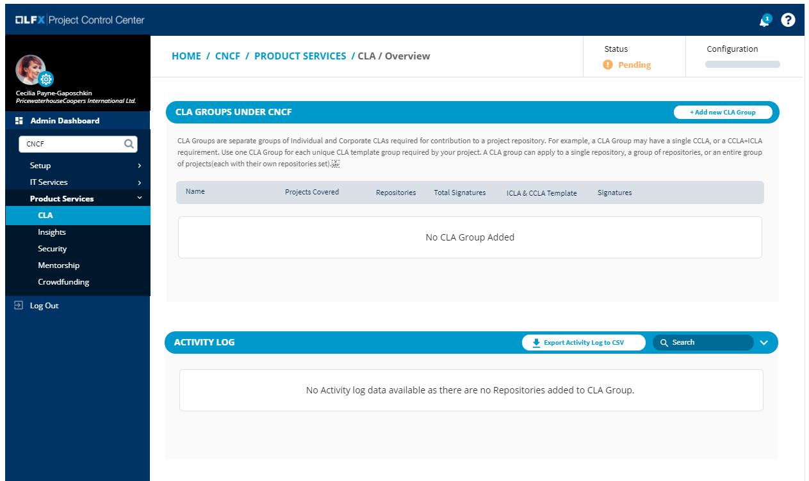
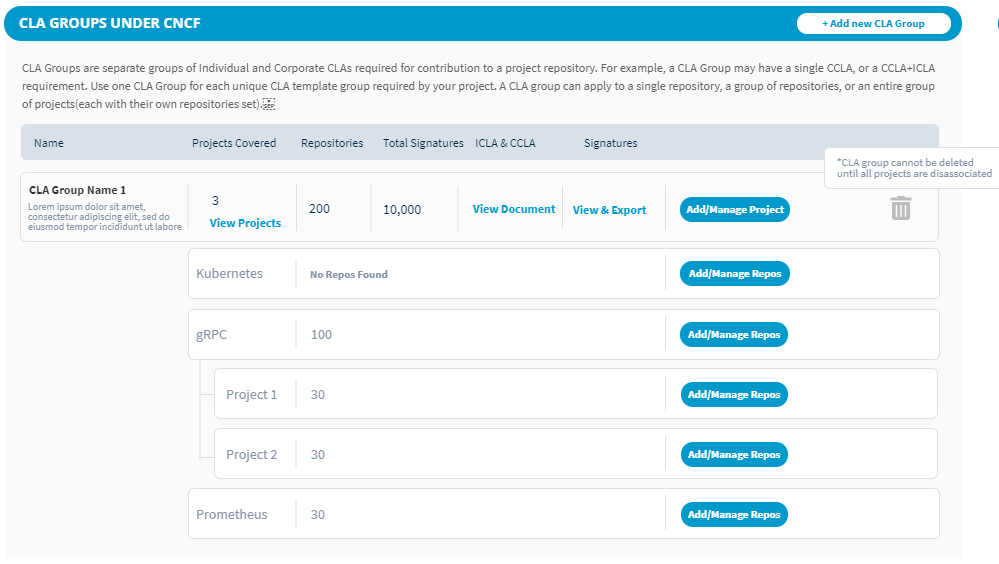

# View CLA Details

#### To view CLA details of a project:

1. [Sign in](sign-in-to-project-control-center.md).

2. Click a **project name** of interest.

3. Navigate to the **Tools** tab, and click **CLA**.

Based on CLA configuration for the project, available data are shown.

* [CLA not Configured for the Project](view-cla-details.md#cla-not-configured)
* [CLA Configured for the Project](view-cla-details.md#cla-configured)

### CLA not Configured

You can configure CLA by [adding a new CLA group](create-new-cla-group.md).

### CLA Configured

Following data are shown for an individual project or a project group that has configured CLA. For more information about signed CLAs, see [View and Manage Signed CLAs](view-and-manage-signed-clas-for-a-cla-group.md).

**Individual Project**

An Individual project doesn't have any child projects under it.

**Project Group:**

For each project, the CLA project console provides the following information:

**CLA GROUPS** shows the CLA groups that you have added to the project. A CLA group defines one or more CLA types that contributors must sign. For more information about signed CLAs, see [View and Manage Signed CLAs](view-and-manage-signed-clas-for-a-cla-group.md).

* **Name** shows the name and description of the project.
* **Projects Covered** \(for individual project\) ****shows the name of the project that is covered under the CLA group.
* **Projects Covered** \(for project group\) shows the number of projects that are added to the CLA group under the project group. Click **View Projects** to view the project names.
* **Repositories** shows the total number of repositories of the project or project group that are enrolled for CLA monitoring.
* **Total Signatures** shows the total number of contributors within the CLA group.
* **View Document** under ICLA & CCLA Template ****lets you view and download the signed templates.
* **View & Export** under Signatures ****lets you view and export the signatures of contributors in `.csv` format.
* **Add/Manage Projects** \(for project groups\) lets you [add or remove project\(s\)](add-or-remove-a-project-from-cla-group.md) from the CLA group.
* **Add/Manage Repositories** \(for individual projects\) ****lets you [add or remove git repositories](add-and-manage-git-organizations-and-repositories/add-or-remove-git-repositories-for-cla-monitoring.md) from CLA monitoring.

**ACTIVITY LOG** shows the recent CLA activities for the project, such as activity description, name of the person who did the activity, date and time of activity, association company's name, and the project for which the activity happened.  

 

