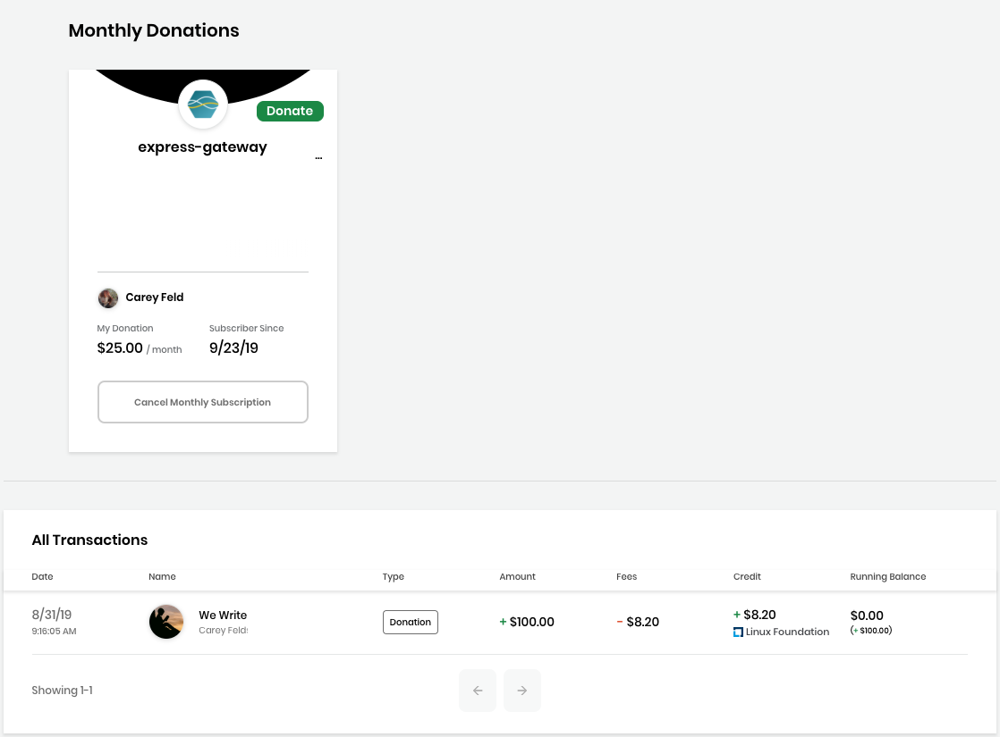
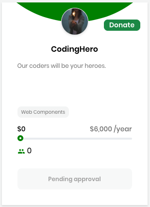
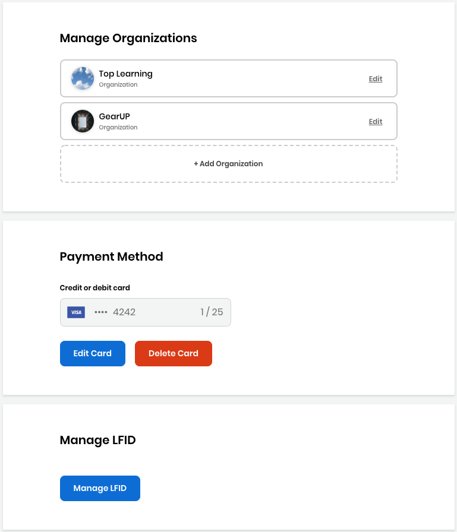
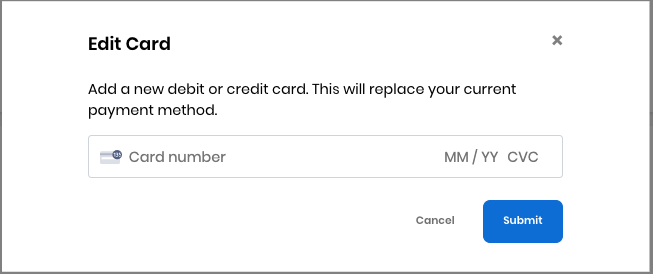
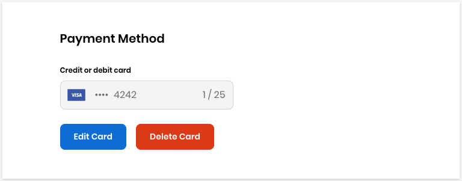

# Manage Your Funding Account

You can manage your CommunityBridge Funding account, for example to view a record of all your transactions or to modify your monthly donations.

**Do these steps:**

1. Log in to CommunityBridge Funding.
2. Go to your user account and select an **option** from the drop-down list:
   * [My Transactions](manage-your-funding-account.md#ManageYourFundingAccount-MyTransactions)
   * [My Projects](manage-your-funding-account.md#ManageYourFundingAccount-MyProjects)
   * [My Profile](manage-your-funding-account.md#ManageYourFundingAccount-MyProfile)
   * [Log Out](manage-your-funding-account.md#ManageYourFundingAccount-LogOut)

## My Transactions 

My Transactions shows your monthly donations and lists all your transactions with details.

* Click **Cancel Monthly Subscription** on a project to cancel your donation subscription. Click **Yes, cancel subscription** on the confirmation dialog that appears.
* Click **Discover projects** to go to the Projects page. This option appears when you do not have any Monthly Donations.

## My Projects 

My Projects lets you see all the projects and funds that you maintain all in one place: My Projects, My Events, and My Travel Scholarships. You can see the status of a project such as "Pending approval" and:

Click **View Project**/**entity** to see the fund details.

Click **Edit Project**/**Event/Scholarship** to edit the fund details.

## My Profile 

**My Profile** lets you manage your organization, payment method, and Linux Foundation identity account.

**Manage Organization** lets you add or edit your organization. Click **+ Add Organization** to add an organization.

**Payment Method** lets you add or change your credit or debit card provider and number.

Click **Add Card** to add your card details.

Click **Edit Card** or **Delete Card** to edit or delete an existing payment method, respectively.

**Manage LFID** opens your Linux Foundation account details, and lets you edit settings such as adding an avatar or more email addresses. Click **Manage LFID** to log in and open your account details. After you edit your account, click **Save**.

## Log Out 

Select **Log Out** from the drop-down list

