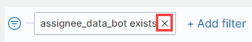

# Add and Manage Data Filters

On a dashboard, you can add a filter for the data results and display only the data that contain a particular value. You can also create negative filters that exclude data that contain the specified value. Filtering makes it easier for you to focus on specific information on a dashboard. The applied filters are shown in the query bar. Negative filters start with NOT in red.

After you add a filter, you can manage it by applying quick actions on the filter label such as excluding matches, and editing or removing the filter.

* [Add a Filter](add-and-manage-data-filters.md#AddandManageDataFilters-AddaFilter)
* [Edit and Manage a Filter](add-and-manage-data-filters.md#AddandManageDataFilters-EditandManageaFilter)

### Add a Filter 

**Do these steps:**

1. On a dashboard, click + **Add filter**. ****The **EDIT FILTER** dialog appears.
2. Click in the **Filter** field and:
   * Select a filter from the **Field** drop-down list.   
   * Select an operator from the **Operato**r drop-down list
   * Type or select a filter value in the **Value** field. **Note:** You can turn on the **Create** **Custom label?** key to open **Custom label** field that lets you enter a label value that identifies your filter subject.
3. Click **Edit as Query DSL** to build a filter using Elastic search Query DSL. You can create positive and negative operators and filter on whether or not a field is present.    
4. Click **Save**. The filter label appears in the query bar.
5. \(Optional\) Click  to display and hide the **CHANGE ALL FILTERS** options as shown in the following example:  
   * **Enable all** enables all the disabled filters.
   * **Disable** **all** disables the filters without removing them. Strike-through indicates that filters are disabled.
   * **Pin all** pins the filters. Pinned filters persist when you switch contexts. For example, you can pin a filter in one dashboard and it remains in place when you switch to another dashboard. A filter is based on a particular index field—if the indices being searched do not contain the field in a pinned filter, it has no effect.
   * **Unpin all** disables all pinned filters.
   * **Invert inclusion** switches the positive filters to negative filters and vice-versa.
   * **Invert enabled/disabled** switches the enabled filters to disabled filters and vice-versa.
   * **Remove all** removes all the filters from the action bar.

### Edit and Manage a Filter 

The Edit filter option lets you manually update a filter and specify a label for it.

**To edit a filter:**

1. Click the filter that you want to edit and click **Edit filter**:     The Edit filter dialog appears.    
2. Edit the filter by clicking **Edit as Query DSL** and following the instructions to edit a filter.      
3. Click **Save**.

**To manage a filter:**

Click the filter that you want to manage,  and select any of the **action buttons** to manage a filter:

* **Pin across all apps**  pins a filter across all applications in one dashboard. It remains in place when you switch to another dashboard. 


**Important:** A filter is based on a particular index field—if the indices being searched do not contain the field in a pinned filter, it has no effect on the dashboard.


* **Edit filter** opens the Edit filter dialog.
* **Include results** includes items that match the specified field value. **Exclude results** option shows when you click Include results.
* **Exclude results** excludes items that match the specified field value. **Include results** option shows when you click Exclude results.
* **Temporarily disable** disables the filter without removing it. Strike-through indicates that a filter is disabled. **Re-enable** option shows when you click Temporarily disable.
* **Delete** removes the filter. **Note:** You can click **×** next to a filter to delete it.   

