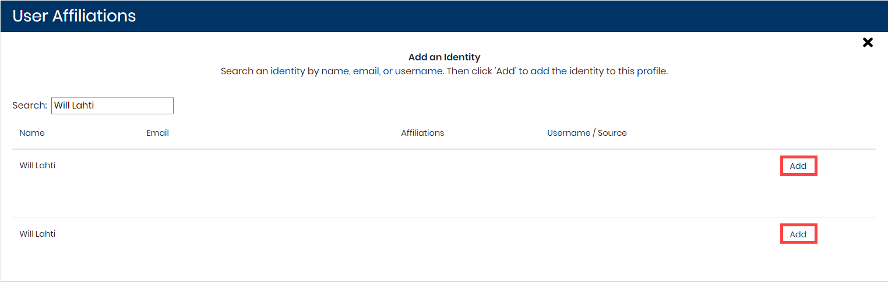

# Merge or Un-merge an Identity Profile

A relational database maintains identities and related information that is automatically extracted from the software tools of your project. An identity is a record \(tuple\) composed of a name, email, username, and the name of the source from where it was extracted. Records are converted to unique identifiers.

Each unique identity has a profile that summarizes the user data. The profile can be linked to more than one identity and you can merge an identity to the profile.


**Important:** 

* LF Insights automatically merges a new identity to an existing profile if the new identity has the same email address and name that of the existing profile in the relational database.
* LF Insights supports names with special characters while checking for an identity:
  * Single Apostrophe \('\)
  * Double Apostrophe \("\)
  * Dejan Mijić
  * Ján Srni?ek, and so on


**Follow these steps:**

1. Select a **project name** of interest.
2. Click **Affiliation Management**.
3. Select a profile from **Top Unaffiliated Contributor** list or [search for a profile](find-a-profile.md).
4. Click a **row** that corresponds to a name of interest. Profile Information appears.
5. Go to **Identity Management**. The profile identities are listed. Each identity shows Name, E-mail, Username, Source, and an Un-merge button. **Note:** Un-merge button is not displayed:
   * If there is only one identity associated with the profile
   * for the unique profile to which identities are merged
6. Continue to merge or un-merge an identity profile:
   * [Merge an Identity Profile](merge-or-un-merge-an-identity-profile.md#merge-an-identity-profile)
   * [Un-merge an Identity Profile](merge-or-un-merge-an-identity-profile.md#un-merge-an-identity-profile)

## Merge an Identity Profile

An identity relates a profile with a unique identity.

**Follow these steps:**

1. Click **Add New**.  
The Add an Identity pane appears:

7. Type a name or email in the **Search** field, and press **Enter**.  
Matching results appear.

8. Find the unaffiliated identity \(Affiliations is blank\) that you want to add, and click **Add** on the row.

9. Click **X** to close the window.  
The added identity is listed in Profile Identities.

## Un-merge an Identity Profile

After you add a unique identity to a profile, the identity appears under Profile Affiliations.

Click **Un-merge**, and confirm ****to unmerge the unique identity from the user profile.

