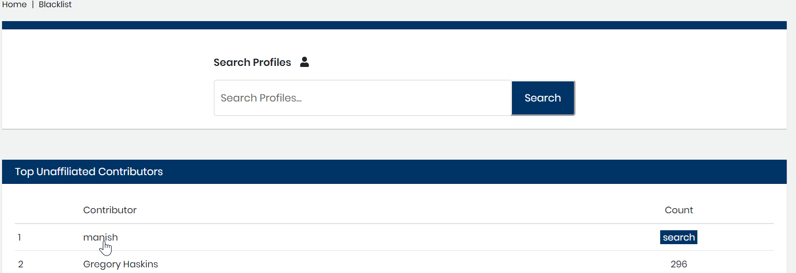
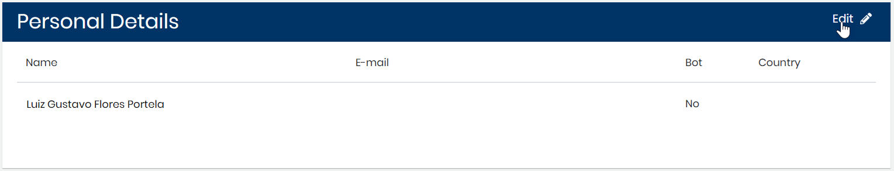

# Edit Profile Personal Details

Edit a profile to add or update contributor information. For example, you want a proper noun to appear in names in dashboards and not a contributor username. You can edit the Name field to the proper nouns, for example: `John Smith` rather than `j_smith`. In another example, you want to mark a profile as a bot to indicate that the activity may not be worth counting. When you [add a dashboard filter](../view-dashboard-analytics/add-and-manage-data-filters.md#AddandManageDataFilters-AddaFilter) to exclude bots, the contributions for this profile are not counted in dashboards.

**Do these steps:**

1. Click a **project** of interest.

2. Click **Affiliation Management**.

3. Select a profile from the **Top Unaffiliated Contributors** list or [search for a profile](find-a-profile.md) that you want to edit.

4. Click a **row** that corresponds to a name of interest.  
Profile Information appears.  
Personal Details show Name, E-mail, Bot, and Country.

5. Click **Edit**.  
****The Name, E-mail, and Bot fields become editable.

6. Update any of the Personal Details and click **Save Changes**.

