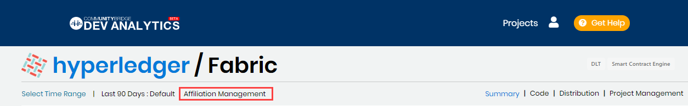

# Sign In to Affiliation Management

Affiliation Management lets you perform actions such as affiliating identities to profiles for your projects. You use your Linux Foundation account credentials to sign in and use Affiliation Management.

**Do these steps:**

1. Go to [https://lfanalytics.io](https://lfanalytics.io/), and click **Admin Sign In**.  
The Sign In window appears.

2. Sign in using your Single Sign-On \(SSO\) account.

3. Select a project for which you have been granted access to use Affiliation Management.  
**Affiliation Management** appears in the menu, next to **Select** **Time Range**. If you do not have access, Affiliation Management does not appear.

4. Click **Affiliation Management**.  
The Affiliation Management Home page appears.

A menu provides the following options:

* **Home** lists the top unaffiliated contributors, and lets you search profiles.
* **Blacklist** lists blacklisted email addresses in alphabetical order, lets you search add an email address to the blacklist, and remove an email address from blacklist.

