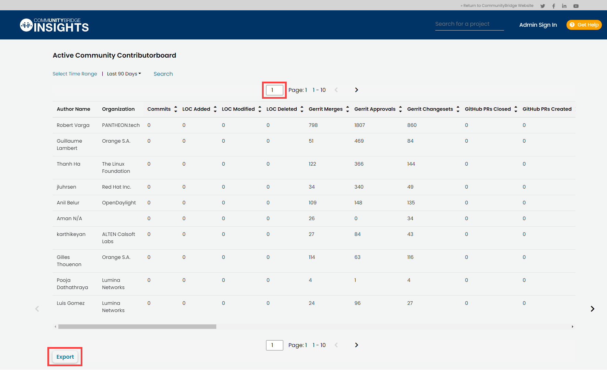

# Active Community Contributor board

Active Community Leaderboard displays an aggregated data of individual contributors for three major data sources—Code based \(Git and Gerrit\), Issue Tracker \(Jira and GitHub Issues\), and Wiki page \(confluence\). Columns, such as Commits, LOC Added, LOC Modified, and LOC Deleted provide data of git repositories.

* Click **Search** to search for contributor's details with author name and organization name. As an administrator for a project, you can also search details with email addresses of contributors of the project.
* You can also quickly search a page by entering the page number in the page number filed as shown below:

* Click **Export** to download the table data to a `.csv` file.
* The Active Community Leaderboard Table lets you sort by values except Author Name, Organization, and Email Id.

| Name | Description |
| :--- | :--- |
| **Author Name** | Name of the contributor |
| **Email Id** | Email address of the contributor **Note:** Only Project Administrators, after signing in, can view Email Ids of contributors. |
| **Organization** | Name of affiliated organization |
| **Commits** | Total number of commits to git repositories over time |
| **LOC Added** | Total number of lines of code added by the contributor to git repositories over time. |
| **LOC Modified** | Total number of lines of code modified by the contributor on git repositories over time. |
| **LOC Deleted** | Total number of lines of code deleted by the contributor on git repository over time. |
| **Gerrit Merges** | Total number of changesets submitted by the contributor that are merged over time. |
| **Gerrit Approvals** | Total number of changesets and patchsets submitted by the contributor that are approved for merge over time. |
| **GitHub PRs Closed** | Total number of pull requests submitted by the contributor that are closed over time. |
| **GitHub PRs Created** | Total number of pull requests created by the contributor over time. |
| **GitHub PRs Merged** | Total number of pull requests submitted by the contributor that are merged to GitHub over time. |
| **GitHub PRs Open** | Total number of pull requests submitted by the contributor that are in open state over time. |
| **Jira Comments** | Total number of comments provided by the contributor for different Jira issues over time. |
| **Jira Issues Created** | Total number of Jira issues created by the contributor over time. |
| **Jira Issues Assigned** | Total number of Jira issues assigned to the contributor over time. |
| **Jira Issues Closed** | Total number of Jira issues submitted by the contributor that are closed over time. |
| **Jira Issues -Avg days In Open** | Average number of days for which Jira issues submitted by the contributor are in open state. |
| **GitHub Issues Created** | Total number of GitHub issues created by the contributor over time. |
| **GitHub Issues Assigned** | Total number of GitHub issues assigned to the contributor over time. |
| **GitHub Issues- Avg Days In Open** | Average number of days for which GitHub issues created by the contributor are in open state. |
| **Wiki Pages Created** | Total number of confluence pages created by the contributor over time. |
| **Wiki Pages Edited** | Total number of confluence pages edited by the contributor over time. |
| **Comments In Wiki** | Total number of comments on confluence pages provided by the contributor over time. |
| **Wiki Blogs** | Total number of blogs on confluence written by the contributor over time. |
| **Date of Last Documentation** | Date when the contributor had contributed for the last time to wiki pages on confluence. |
| **Days since Last Documentation** | Total number of days since the contributor has not contributed anything to wiki pages on confluence. |

