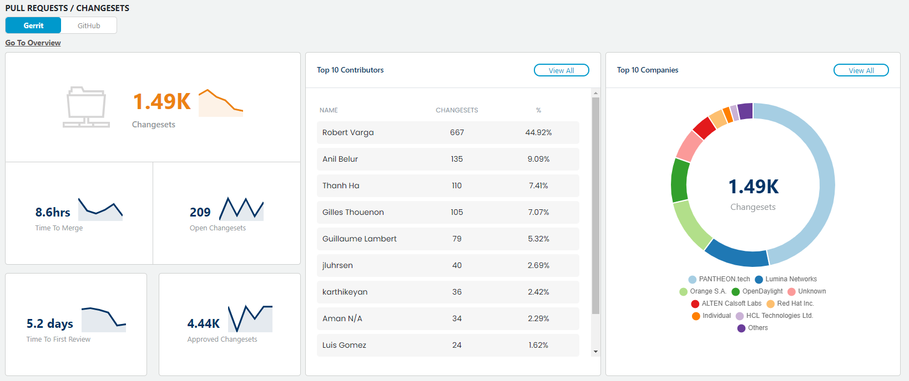
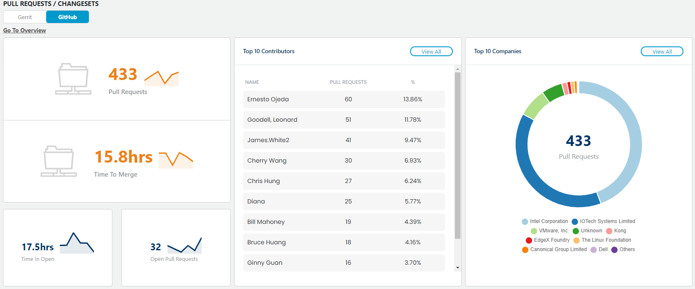
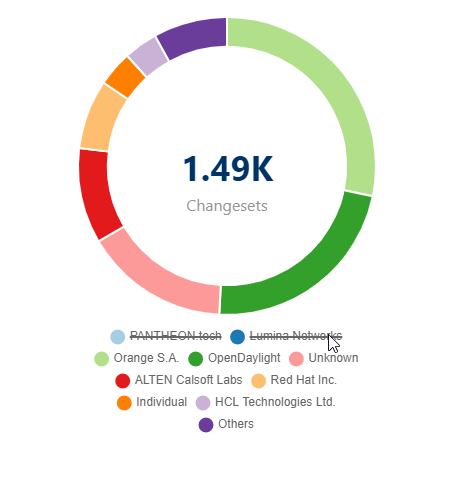
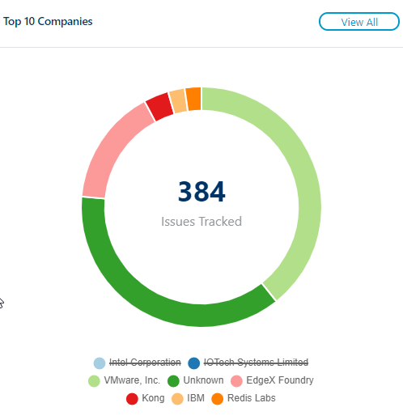
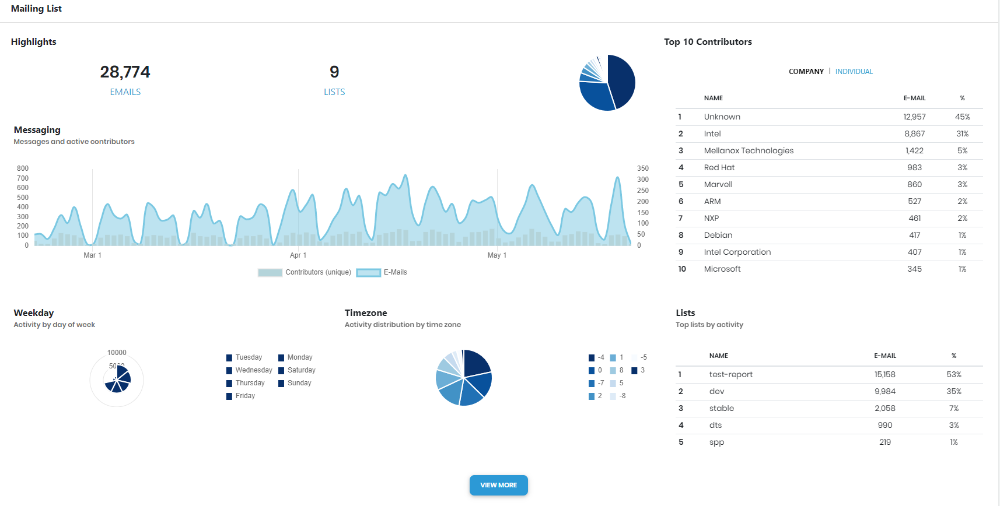
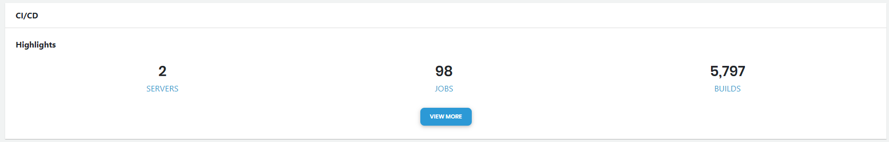
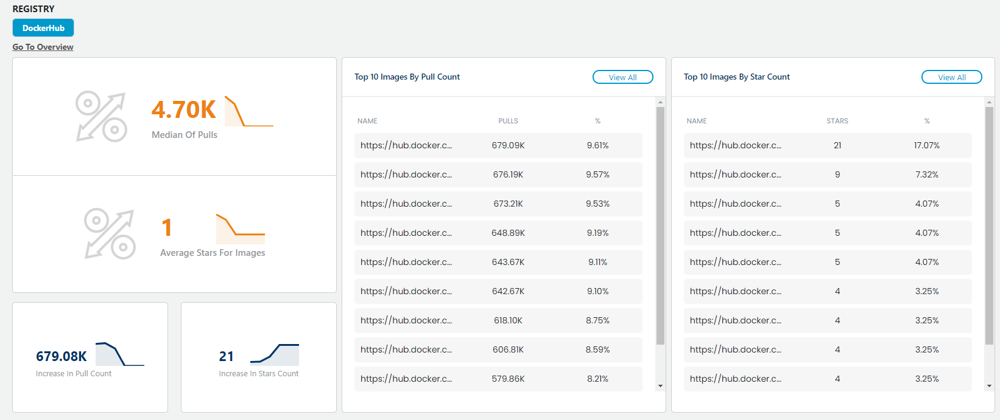
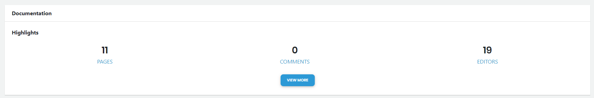
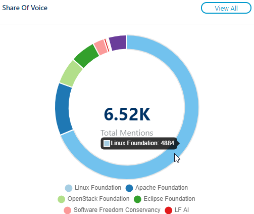
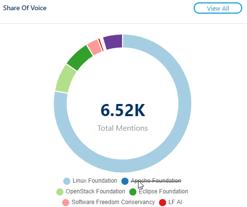

# Summary


By default, Bot commit is filtered, and can't be included for Summary dashboard.


Summary provides a high-level metrics about each data source for which the project is configured. Following are activities for quick navigation:

* Click Copy Short URL  to copy the link of summary dashboard for a project.
* Select a value from the drop down to quickly navigate to the respective section on Summary dashboard:  
  * [Source Control](summary.md#source-control)
  * [Pull Requests / Changesets](summary.md#pull-requests-changesets)
  * [Issue Management](summary.md#issue-management)
  * [Chat Room](summary.md#chat-room)
  * [Mailing List](summary.md#mailing-list)
  * [Ci/Cd](summary.md#ci-cd)
  * [Registry](summary.md#registry)
  * [Documentation](summary.md#documentation)
  * [Earned Media](summary.md#earned-media)
* Clicking sparklines   opens a stacked bar graph that represents relevant data per calendar period.   
* Clicking numbers on a data card opens the respective dashboard.   
* While navigating from top to bottom on Summary dashboard, click  on the down right corner to reach to the top of the page.

### **SOURCE CONTROL**

**Source Control** shows analytic overview of git commits for a selected time range. Default time range is **Last 90 Days**. You can [select a time range](../filtering-data/select-time-range.md) to view  data for the selected time range.

* Clicking **Go To Overview** and **View All** takes you to the respective table/chart/graph of [Commits &gt; Overview](source-control/git.md) page.

**Commits** shows the following information:

* **Lines Of Code Changed** represents total number of lines changed—added, updated, and deleted—for a selected time range.
* **Commits** represents total number of commits for a selected time range.
* **Contributors** represents the number of contributors for the project
* **No Of Sub Projects** represents total number of sub projects \(added git repositories\) under a project.
* **Repositories** represents total number of repositories of the project. This includes the number of repositories of sub projects.

**Top 10 Contributors** lists the top ten individuals—that contribute most to the project— by name, total number of lines of codes changed that includes lines of codes added plus modified, number of commits, and percentage of commits out of the total number of commits by the community. Click **View All** to navigate to the [Commits &gt; Overview](source-control/git.md) page.

**Top 10 Companies**  lists the top ten companies—that contribute most to the project— by name, total number of lines of codes changed that includes lines of codes added plus modified, number of commits, and percentage of commits out of the total number of commits by the community.

Mouse over a color in the doughnut chart to view company name and number of commits made by the company. Click a company name to exclude company data. Click again to add the company data. Following is an example:  
  


* **Unknown** as a company name shows number/percentage of codes submitted by those contributors who are not affiliated with any organization.
* **Others** represents a group that combines all other companies that come after top nine companies that contributes more.


### **PULL REQUESTS /** CHANGESETS

Pull Requests/Changesets shows analytic overview of pull request information of GitHub repositories and/or information about changesets and patchsets per changeset for Gerrit.


Data is not available for a Git data source that is not configured for CommunityBridge Insights.


**Gerrit** shows total number of changesets \(both open and closed\), number of open changestes, average time in hours to merge changesets, average time in days for first review of changeset, and total number of approved changesets for a selected time range.

* Clicking **Go To Overview** and **View All** under **Gerrit** takes you to the respective table/graph/chart of [Gerrit Changesets &gt; Overview](pull-request-management/gerrit-changestes.md#overview) section.

**GitHub** shows total number of pull requests \(both open and closed\), number of open pull requests, average time in hours to merge pull requests, and average time in hours pull requests were open for a selected time range.

* Clicking **Go To Overview** and **View All** under **Gerrit** takes you to the respective table/chart/graph of [GitHub PR &gt; Overview](project-management/github-issues.md#overview) section.

**Top 10 Contributors** lists the top ten individuals—that contribute most to the project— by name, total number of lines of codes changed that includes lines of codes added plus modified, number of commits, and percentage of commits out of the total number of commits by the community.

**Top 10 Companies**  lists the top ten companies—that contribute most to the project— by name, total number of lines of codes changed that includes lines of codes added plus modified, number of commits, and percentage of commits out of the total number of commits by the community.

* Mouse over a color in the doughnut chart to view company name and number of commits made by the company. 
* Click a company name to exclude company data. Click again to add the company data. Following is an example:  


* **Unknown** as a company name shows number/percentage of codes submitted by those contributors who are not affiliated with any organization.
* **Others** represents a group that combines all other companies that come after top nine companies that contributes more.


### **ISSUE MANAGEMENT**

**Issue Management** shows analytic overview of issue management platforms used by a project, such as Jira, GitHub Issues, and Bugzilla.

**Jira** shows total number issues that includes both open and closed issues, total number of submitters, number of open issues, average time in days the issues are open, and time in days for which a stacked area chart compares the number of issues and unique contributors per calendar period.

* Clicking **Go To Overview** and **View All** under **Jira** takes you to the respective table/chart/graph of [Jira &gt; Overview](project-management/jira.md#overview) section.

**GitHub Issues** shows total number issues that includes both open and closed issues, total number of submitters, number of open issues, average time in days the issues are open and average time in days the issues took to be resolved.

* Clicking **Go To Overview** and **View All** under **Github Issues** takes you to the respective table/chart/graph of [GitHub Issues &gt; Overview](project-management/github-issues.md#overview) section.

**Bugzilla** shows total number issues that includes both open and closed issues, total number of submitters, number of open issues, total time in days the issues are open, and time in days issues took to be closed.

* Clicking **Go To Overview** and **View All** under **Bugzilla** takes you to the respective table/chart/graph of [Bugzilla &gt; Overview](project-management/bugzilla.md#Bugzilla-Bugzilla>Overview) section.

**Top 10 Submitters** lists the top ten individuals— that contribute most to the project— by name, total number of issues, and percentage of issues out of the total number of issues submitted by the community members.

**Top 10 Companies** lists the top ten companies— that contribute most to the project— by name, total number of issues, and percentage of issues out of the total number of issues submitted by the community.

Mouse over a color in the doughnut chart to view company name and number of commits made by the company. Click a company name to exclude company data. Click again to add the company data. Following is an example:  
  


* **Unknown** as a company name shows number/percentage of issues submitted by those contributors who are not affiliated with any organization.
* **Others** represents a group that combines all other companies that come after top nine companies that contributes more.


Following an example of Issue Management overview section for a project that uses Jira, GitHub Issues, and Bugzilla to manage issues:

### **Chat Room**

**Chat Room** shows an analytic overview of Slack and RocketChat channels used by a project.

**Slack** shows total number of messages, channels, participants, replies, and reactions over time. Clicking **Go To Overview** and **View All** under **Slack** takes you to the respective table/chart/graph of [Slack &gt; Overview](chat-room/slack.md#overview) section.

**RocketChat** shows total number of messages, channels, participants, replies, and reactions over time. Clicking **Go To Overview** and **View All** under **RocketChat** takes you to the respective table/chart/graph of [RocketChat &gt; Overview](chat-room/rocket-chat.md#overview) section.

**Top 10 Message Senders** lists the top ten individuals—who communicate most in the project— by name, number of messages, and percentage of messages out of the total number of messages shared by the community.

**Top 10 Channels** lists the top ten slack channels where most amount of communication is happening. It shows the channel name, number of messages per channel, and percentage of messages per channel. Following is an example of chat room dashboard:

### **Mailing List**

**Mailing List** shows an analytic overview of email communication channels, such as Groups.io or Pipermail:

**Groups.Io** shows total number of emails, groups, companies, authors, and average number of messages communicated over time.

**Piper Mail** shows total number of emails, mailing lists, companies, authors, and average number of messages communicated over time.

**Top 10 Email Senders** lists the top ten individuals—who communicate most in the project— by name, number of emails, and percentage of emails out of the total number of emails shared by the community.

**Top 10 mailing Lists** lists the top ten email lists where most number of communication is happening. It shows the list name, number of emails per list, and percentage of emails per list. 

### **CI/CD**

**CI/CD** shows an analytic overview of the number of total builds, jobs, failed builds, job categories, and average build duration in minutes. Clicking **Go To Overview** and **View All** under **CI/CD** takes you to the respective table/chart/graph of [Jenkins &gt; Overview](ci-cd/jenkins.md#overview) section.

**Top 10 Jobs** lists the top ten jobs by name, number, and percentage.

**Build Results** shows a doughnut chart that represents total number of builds for all the build results, such as Success, Failure, Unstable, and Aborted. Click a result to exclude the data. Click again to include.

### **Registry**

**DockerHub** shows total number of median pulls, average stars for images, increase number in pull count, and star counts. Clicking **Go To Overview** and **View All** opens the respective table/chart/graph of [Docker &gt; Overview](registry/dockerhub.md#DockerHub-DockerHub>Overview) section.

**Top 10 images By Pull Count** lists the top ten pulls by name, number, and percentage.

**Top 10 images By Star Count** lists the top ten stars by name, number, and percentage.

### **Documentation**

**Confluence** shows an analytic overview of project's confluence pages for a selected time range. It shows total number of confluence pages created/edited, total number comments in the form of feedback or conversation on confluence pages, total number of editors who contributed to create/edit or provide feedback/comment on the confluence pages, and average number of editors per day.

**Top 10 Editors** lists the top ten individuals— who makes most number of edits/updates— by name, number of pages edited by the individual, and percentage of contribution out of the total document contribution by the community members.

**Top 10 Companies** lists the top ten companies— that contribute most to the project— by name, total number of editions, and percentage.

### Earned Media

**Earned Media** shows analytic overview of how many times consumers \(unique users\) searched, mentioned, and shared project related articles or blogs  on different media platforms, starting from Facebook, Linked to blog sites and news publishing websites. This helps project administrators, companies and organizations to understand software development projects through quantitative analysis of social media activity, and processes. The data Earned Media includes various metrics, such as geographical data, sentiment analysis, SEO metrics, social media sharing/mentions, publishers, and so on.

* Clicking sparklines opens a stacked bar graph that represents relevant data per calendar period.
* Clicking the number beside the sparklines opens the respective dashboard.
* Clicking **View All** opens the respective dashboard.

**Total Shares** shows how many times a project's search results are shared by consumers on different social media platforms. This also shows number of shares on individual social media platforms.

**Top 10 Publishers** lists top ten media houses and blog sites that mention most about the project in the form of articles and blog posts. It includes the number and percentage of mentions about your project.

**Share of Voice** shows a doughnut chart that displays how many times the project and its competitors' search results are mentioned by consumers \(unique users\). Mouse over a color in the chart to see the number of mentions for a project out of the total mentions. For example, Linux Foundation is mentioned 4.88k times by consumers on different media platforms out of the total 6.52k times including its competitors' mentions as per the following data.

Click a project name as shown below to exclude the result. Click again to include.

