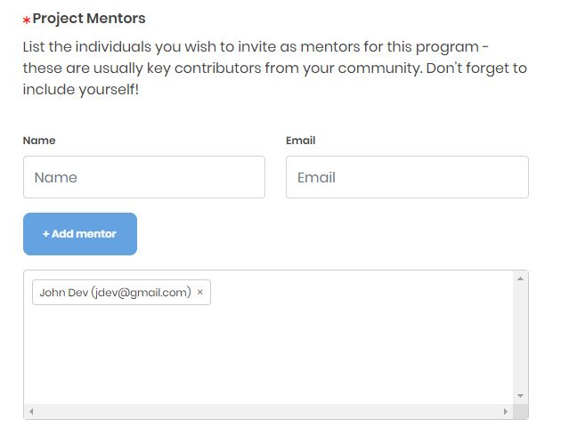

# Add Mentors

You can add mentors to the project by adding their name during project enrollment. For details, see the Project Mentors row of Program Setup section of [Mentorship Project Application](enroll-your-project/mentorship-project-enrollment-form.md#MentorshipProjectApplication-ProgramSetup) form.

## Accepting Mentors Requests: 

You may receive an email informing you that a mentor is interested in volunteering for your program. Review mentor's profile and if the mentor is a good match, click on **Add to Project** CTA in the email to navigate to Edit Project form where you can add the mentor to **Project Mentors** section. 

