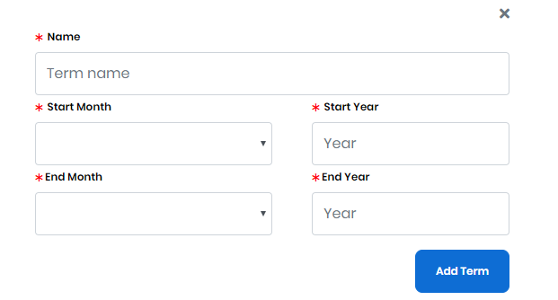
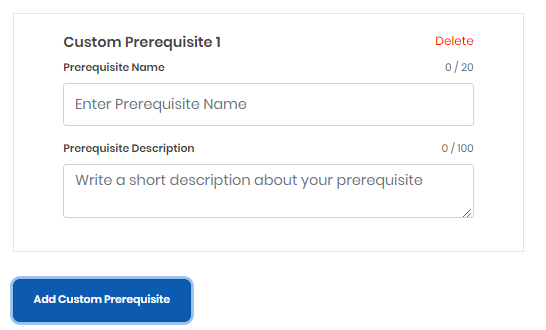
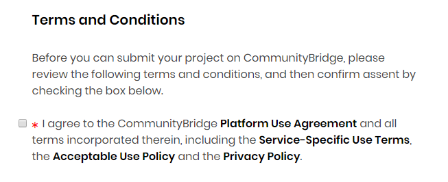

# Mentorship Project Enrollment Form

### Project Details 

The below table describes the fields of Mentorship Project Enrollment Form

<table>
  <thead>
    <tr>
      <th style="text-align:left">Name</th>
      <th style="text-align:left">Description</th>
    </tr>
  </thead>
  <tbody>
    <tr>
      <td style="text-align:left"><b>Project Name</b>
      </td>
      <td style="text-align:left">(Required) Name of the project.
         CommunityBridge supports one administrator per project who serves as the
        administrator of that project within Mentorship&#x2014;no one else can
        claim this project for Mentorship. This project name appears on your project
        page.</td>
    </tr>
    <tr>
      <td style="text-align:left"><b>Technologies</b>
      </td>
      <td style="text-align:left">(Required) Type of industry that relates to your repository. For example,
        the Cloud topic is appropriate for an Express Gateway project. Click in
        the field to open a list of names to choose from. Click
        after you select a category from the list.
         <b>Note: </b>The category/categories are reflected in the<b> List of technologies you have added... </b>field
        after you add a category.</td>
    </tr>
    <tr>
      <td style="text-align:left"><b>Elevator pitch</b> 
      </td>
      <td style="text-align:left">(Required) Brief statement of why your project is important to be supported.</td>
    </tr>
    <tr>
      <td style="text-align:left"><b>Repository URL</b>
      </td>
      <td style="text-align:left">(Required) URL of the GitHub repository.
         CommunityBridge uses this URL to display the repository statistics on
        your project page, and to provide a link to the project&#x2019;s repository.</td>
    </tr>
    <tr>
      <td style="text-align:left"><b>Website URL</b>
      </td>
      <td style="text-align:left">(Optional) The Website address that you want to associate with the fund.</td>
    </tr>
    <tr>
      <td style="text-align:left"><b>CII Project ID</b>
      </td>
      <td style="text-align:left">
        
(Optional) The <a href="https://www.coreinfrastructure.org/programs/badge-program/">Core Infrastructure Initiative (CII) Badge Program</a> Project
          ID number, for example: 24.

        
The CII Badge Program is an open source secure development maturity model.
          Projects that have a CII badge showcase the project&#x2019;s commitment
          to security. Examples of criteria include basic open source development
          practices (website, open source license, and user engagement), use of change
          control tools, attention to quality (automated test suite), and focus on
          security (secure project delivery method, use of dynamic and static analysis
          tools, as appropriate for the project). Consumers of the badge are able
          to quickly assess which open source projects care about security-conscious
          development. Although participating in the CII Badge Program is optional,
          we encourage you to enroll in the program within the first 90 days from
          your application submission. The badge displays on your project dashboard
          to showcase your project&#x2019;s status and progress on security and other
          metrics.

        
Click <b>Apply for CII</b> to get a badge and CII Project ID number if your
          project does not have one. You answer a questionnaire to be awarded a Best
          Practices Badge and a CII Project ID if you are approved. A questionnaire
          snippet follows:

        

          
           
           <b>Note: </b>If you don&apos;t provide a CII Project ID while submitting
          an application, you must provide it within 90 days of the project approval
          for the project to remain on CommunityBridge.
           
        

      </td>
    </tr>
    <tr>
      <td style="text-align:left"><b>Code of Conduct URL</b>
      </td>
      <td style="text-align:left">(Optional) An agreement that describes the rules of behavior for the members
        of the project. Specify a URL for your code of conduct or create a code
        of conduct by clicking <b>Start from a template</b>. A default <a href="https://www.contributor-covenant.org/version/1/4/code-of-conduct">Contributor Covenant</a> appears
        and you can use it as a template. Click <b>Add Custom Website</b> to add
        a website to your project by entering a website name and URL.
         
      </td>
    </tr>
    <tr>
      <td style="text-align:left"><b>Project Logo</b>
      </td>
      <td style="text-align:left">(Optional) A symbol or other design adopted by your organization that
        identifies your project. Click <b>Browse</b> to upload a file. Preview shows
        the logo that you uploaded.
         <b>Note:  </b>File type- JPG, PNG, SVG
         File size- 2MB (maximum)</td>
    </tr>
    <tr>
      <td style="text-align:left"><b>Project Accent Color</b>
      </td>
      <td style="text-align:left">(Required) The hexadecimal number for the color that you want to use as
        your project brand, for example, #008000 is green.
         Enter a <b>hexadecimal number</b> or click in the field to open the color
        picker. Use the picker by clicking inside the color field to pick a color.
        You can use the up/down arrows to refine the color by editing the color
        values. The gray field refreshes to match your selection.</td>
    </tr>
  </tbody>
</table>

### Program Setup 

The following table lists all the fields that appear on the Program Setup page of Mentorship Project Application:

<table>
  <thead>
    <tr>
      <th style="text-align:left">Name</th>
      <th style="text-align:left">Description</th>
    </tr>
  </thead>
  <tbody>
    <tr>
      <td style="text-align:left"><b>Required and/or desirable skills and training</b>
      </td>
      <td style="text-align:left">The skills and qualifications of individuals applying as mentees for the
        Mentorship program. Click in <b>Skill Name</b>, select a <b>skill</b>, and
        then click <b>+ Add skill</b>
         The added skills appear on the <b>List of skills you have added...</b> field.</td>
    </tr>
    <tr>
      <td style="text-align:left"><b>Project Mentors</b>
      </td>
      <td style="text-align:left">
        <ul>
          <li><b>Name</b> is the first name and last name of the individual.</li>
          <li><b>Email</b> is the email of the individual.</li>
        </ul>
        
Click <b>+ Add mentor</b> to add the individual.

        
<b>Note:</b> When your application is approved, individuals that you specify
          here receive emails inviting them to participate in the Mentorship program
          as mentors.

      </td>
    </tr>
    <tr>
      <td style="text-align:left"><b>Program Terms</b>
      </td>
      <td style="text-align:left">
        
Click <b>Add Term </b>to add a custom term. Complete the fields and click <b>Add Term</b>.
          The terms appear under Current Terms subheading. Once your current term
          ends, it shows under Past Terms subheading. You can edit or delete a term
          until there are mentees associated with it.

        
<b>Note: </b>You can run maximum two terms at the same time

        

          
          
        

      </td>
    </tr>
  </tbody>
</table>

### Prerequisites 

Each mentee applicant must complete at least one prerequisite task to qualify for the mentorship program. These prerequisite tasks appear in the **Tasks** view of your project. Tasks view lets you edit and change statuses for tasks.

Select a checkbox to add a prerequisite name. Click **Add Custom Prerequisite** to add name and description of your own required task.

* **Prerequisite Name** is the name of a qualification task that you want an applicant to complete.
* **Due Date** is the date by which you want a mentee to complete the task.
* **Prerequisite Description** is a detailed description of the activities and any other factors that are involved in or required for the task. A detailed and exact description helps eliminate unqualified applicants and improves suitable matches.
* Select the check box if a mentee needs to submit a file in order to complete the task.
* Click **+ Add Custom Prerequisite** to add the prerequisite task.

### Terms and Conditions 

Read the terms and conditions, and select the checkbox to proceed.

  

