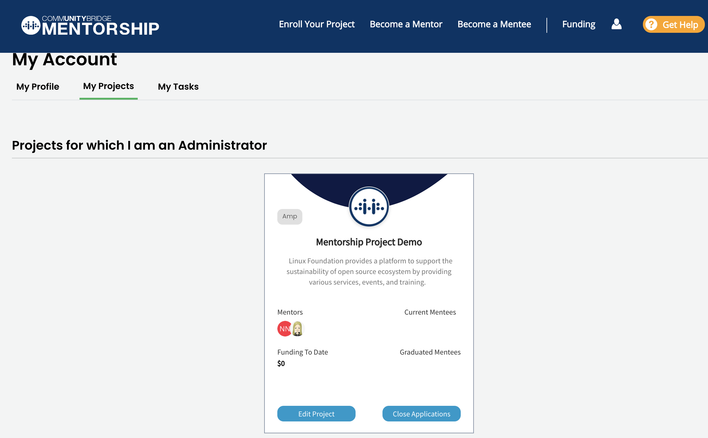

# Manage Your Account

To manage your account [Sign in](../../../sso/sign-in/) to [Mentorship](https://people.communitybridge.org/) and navigate to your user account and select an **option** from the drop-down list:  
    

## My Profile

**My Profile** option takes you to [Individual Dashboard \(MyProfile\)](https://myprofile.linuxfoundation.org/), a self-service dashboard where you can edit your contact information, change your password, keep track of your emails and community identities, and much more. 

## My Projects

My Projects page contains the cards of all mentorship programs for which you're an admin.

\*\*\*\*

