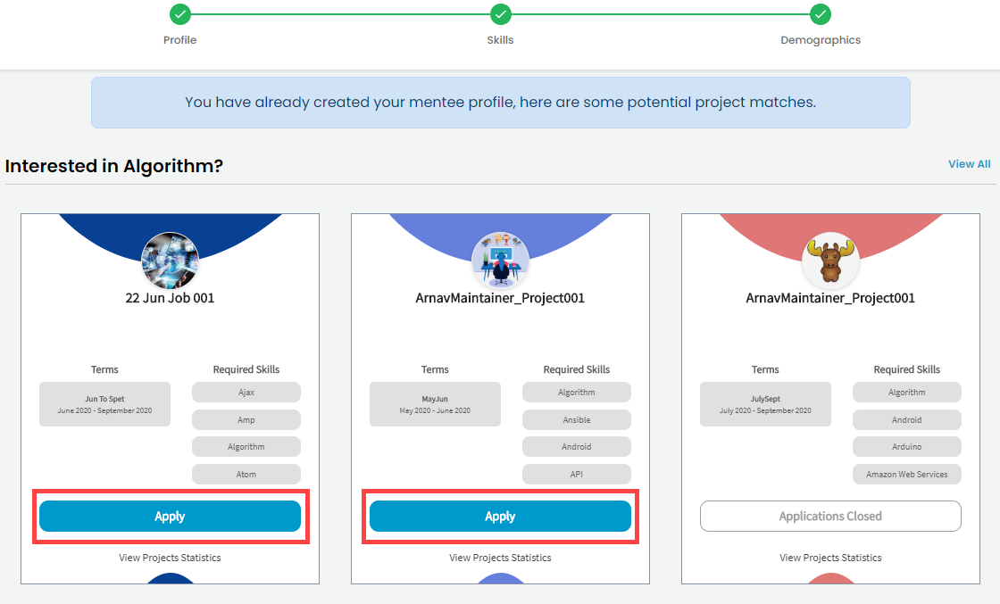

# Apply to a Mentorship Program

1. To apply to a mentorship program [Sign in](../../../sso/sign-in/) to the [Mentorship](https://people.dev.platform.linuxfoundation.org/) platform. If you haven't created a profile yet, click on **Become a Mentee** menu item.


* Steps to create a profile are described in [Create a Mentee Profile](create-a-mentee-profile.md) section.


2. If you have a mentee profile you will be presented with projects that match your skills. Click **Apply** CTA on a mentorship card to apply.    


**Important:**

* You can apply to maximum **three** mentorship in one term.
* You can reapply to mentorship programs if you were previously declined or you withdrew your application.


3. You will receive a confirmation message and a confirmation email stating that your application was received. 

NOTE: Your application will be in **Pending** status until you submit all your prerequisite requirements and the project admin changes the status of your application. For details, see [View Status of your Application](view-status-of-your-application.md)

