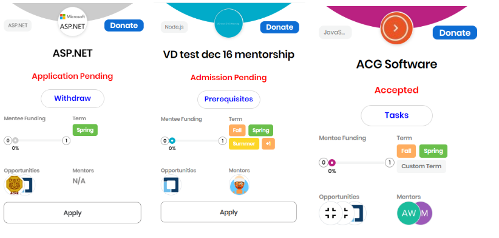

# View Status of your Application

**To view status of your application:**

1. Navigate to **My Account &gt;** **My Projects.**   
2. Under **Projects for which I am a mentee** section, you can view the statuses:

Following are the descriptions for each status:

* **Application Pending:** You have submitted application, and it is in **Pending** state. The project admin or mentor is yet to review of your application. Anytime, you can withdraw your application.
* **Accepted:** Project admin or mentor has accepted your application. You receive an email notification from CommunityBridge Team. Click **View Tasks** to view and complete all the tasks or navigate to **My Account &gt;** **My Tasks** to view and complete tasks for a project.
* **Declined:** Your application is declined as your profile doesn't match with the project requirements.
* **Withdrawn:** Either you or the project admin has withdrawn your application.
* **Graduated:** You have successfully graduated from the mentorship program.


* You can filter your tasks by selecting option/options from **Status** drop-down.
* You can also change the status of task/tasks by selecting **In Progress** or **Submitted** from the drop-down, as per your progress. The respective project administrator is notified about change of your status.


