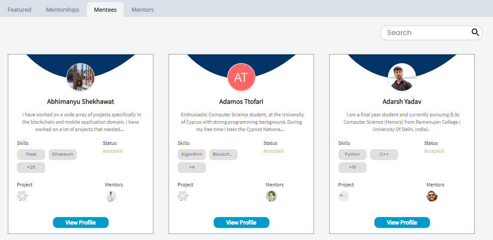

# Platform Overview

The CommunityBridge Mentorship platform facilitates a structured remote learning environment to new open source developers. Experienced project maintainers and contributors use the platform to mentor aspiring individuals and help them become contributors to the open source community.

**To Get started:**

1. Navigate to to [CommunityBridge Mentorship](https://people.communitybridge.org/) dashboard:
   * [Mentorships](./#DashboardOverview-Projects) tab includes the mentorships enrolled on the platform, categorized by projects accepting mentee applications, as well as in progress and completed mentorships.
   * [Mentors](./#DashboardOverview-Mentors) tab includes profiles all the participating mentors.
   * [Mentees](../mentees/) tab includes profiles of currently participating and graduated mentees.
2. To view more information about each mentorship projects, navigate to the project dashboard to: 
   * [View Projects Details](view-projects-details.md)
   * [View a Mentor or Mentee Profile](view-a-mentor-or-mentee-profile.md)
   * [Toggle Between Mentorship and Funding](../../crowd-funding/dashboard/toggle-between-funding-and-mentorship-for-a-project.md)
3. To participate:
   * Administrators – [enroll your mentorship project](https://app.gitbook.com/@lfdocs/s/docs/communitybridge/mentorship/administrators/enroll-your-project)
   * Mentees – [create a profile](../mentees/become-a-mentee/create-a-mentee-profile.md) and [apply to a project](../mentees/become-a-mentee/apply-to-a-project.md)
   * Mentors – [create a profile](../mentors/become-a-mentor/create-a-mentor-profile.md) and [request to be added to a project](../mentors/become-a-mentor/apply-to-or-remove-your-application-from-a-project.md#apply-to-a-project)

## Mentorships 

**Mentorships** shows the following tabs:

* **All Mentorships** shows all the mentorship programs on Linux Foundation
* **Accepting Applications** shows the yet-to-start mentorship programs. As a mentee, you can apply to participate in the mentorship program.
* **In Progress** shows the currently running mentorship programs.
* **Completed** shows all completed programs.

Navigate to a project card of interest or type a project name in the **Search** box for quick search. Each project card shows the following information:

* **Project name and logo**. Click the project title or logo to see more information about it.
* **Terms** shows the Mentorship program timelines that are available for mentees and mentors.
* **Required Skills** shows names of the technologies that are required to apply to the project.
* **Apply** lets you [apply](../mentees/become-a-mentee/apply-to-a-project.md) to the project.
* **Applications Closed** is shown when a [project administrator closes applications](../administrators/open-or-close-mentorship-applications.md).
* Clicking **View Projects Statistics** flips over the project card, and shows the following information:
  * Project logo, name, and an excerpt of project description.
  * **Donate** opens a [New Donation form](../../crowd-funding/donate-sponsor/donate-as-an-individual.md#result-new-donation-form-appears) in CommunityBridge Funding. You can donate as an [individual](../../crowd-funding/donate-sponsor/donate-as-an-individual.md) or as an [organization](../../crowd-funding/donate-sponsor/donate-as-a-sponsor/).
  * **Mentors** shows images of mentors for the project.
  * **Current Mentees** shows images of currently participating mentees for the project.
  * **Graduated Mentees** shows images of mentees who successfully completed the mentorship program.
  * **Funding To Date** shows the total project fund amount received to date for mentee stipends.
* **Back To Project Overview** lets you to go back to the overview card.

## Mentees 

**Mentees** shows the mentee profile cards. Type a mentee name in the **Search** box for quick search. Each mentee profile card shows the following information :

* Mentee name and image identify the mentee. Click the name to see more information about the mentee.
* **Skills** shows keywords that help you accept a mentee who has the required skill for your project's mentorship program.
* **Status** shows the current status of the mentee, for example Accepted, Graduated, and so on.
* **Mentors** shows the images of the individuals under whose guidance the mentee is learning a skill.
* **Projects** shows the project logos in which the mentee participates.
* Click **View Profile** to view more information about the mentee.

## Mentors 

**Mentors** shows the mentor profile cards. Type a mentor name in the **Search** box for quick search. Each mentor profile card shows the following information :

* Mentor name and image identify the mentor. Click the name to see more information about the mentor.
* **Skills** shows keywords that help you match up with a mentor who has direct experience in the industry or subject for which you need help.
* **Current Mentees** shows the images for the persons who are learning a skill from the mentor.
* **Graduated Mentees** shows the mentees who completed the Mentorship program under this mentor's guidance.
* **Projects** shows the project logos in which the mentor participates or contributes.
* Click **View Profile** to view more information about the mentor.

