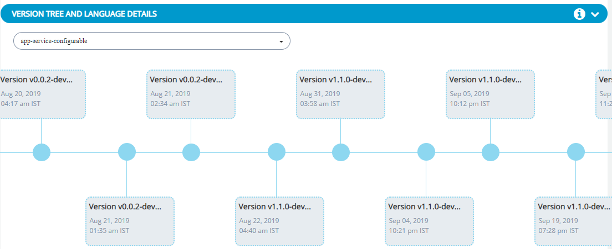

# Get a Vulnerability Status Overview

The Overview dashboard gives you an overall view of security issues and history of all the repositories in your project to make them prominent. LFX Security uses the Common Vulnerability Scoring System \(CVSS\) as a standard measurement for the severity of vulnerabilities. 

CVSS prioritizes vulnerability remediation activities and calculates the severity of vulnerabilities discovered in all your project repositories. The National Vulnerability Database \(NVD\) provides CVSS scores for almost all known vulnerabilities. Vulnerabilities are classified into HIGH/MEDIUM/LOW severity for easy prioritization.

**Do these steps:**

1.[Sign In](../../sso/sign-in/) to [LFX Security](https://security.lfx.linuxfoundation.org/).  
                                     Or  
    [Sign In](../../sso/sign-in/) to[LFX Funding](https://funding.lfx.linuxfoundation.org/) if you have added your project to LFX Funding.

**Overview** shows number of vulnerabilities according to their severity level, it also shows number of fixable vulnerabilities. 

**Dependency Issues Over Time** shows a timeline of when security issues occurred and how many issues occurred at a certain time. Lines and icons in the timeline are colored to represent the threat levels.

Use this information to prioritize your investigation and remediation. To prioritize vulnerabilities, you might target one high-threat issue first. Additionally, it is important to focus on threats detected multiple times in the scanned code. Resolving one of these issues can make a marked difference in the security of the overall codebase.

## History 

**Security History** shows the date of the vulnerability scan, the scan status, number  of vulnerabilities,  the threat level is indicated as HIGH, MEDIUM, or LOW and the fixed recommended. 

## Version Tree and Language Details

Version tree is a graphical representation of the version details for a particular repository. As and when the changes are updated for the repository, a new version of the repository is created. This version tree provides details such as version number, updated date and time. 


By default version tree shows version information from beginning of GitHub Organization.



When the date range is selected as **All Time**, the version tree shows the version details when the repository was created in the GitHub. 


Language details is a graphical representation of the different code languages such as Go, Typescript, SCSS, HTML, PLpgSQL, shell and other languages available in the  repository. Language details provides a pie chart that shows the code breakup percentage of the language for the GitHub repository. This percentage helps you to identify the various language used and the percentage of that language used in the repository.

