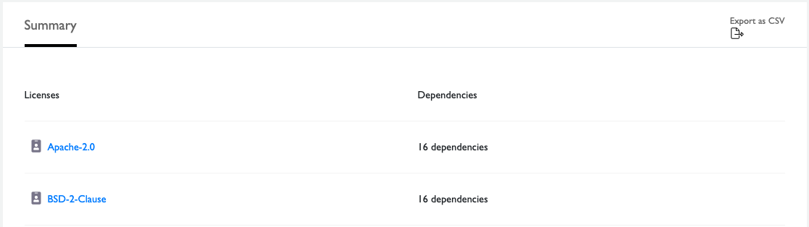

# Get License Information

CommunityBridge Security identifies the licenses that are used by your projects and their dependencies.

**Do these steps:**

1.Select **Licenses** from the top menu. All licenses are listed in alphabetical order for the dependencies in a project by their license identifier, for example, `Apache-2.0`. The list also shows the number of dependencies for each license. Dependencies with more than one license are shown individually.  

2.Click a license **identifier**   ****icon  to go to the SPDX License and find out more information about a license. The SPDX License includes a full name, standardized short identifier, vetted license text, and other information about the license.

3.Click **Export as CSV** to export the data to a Comma-Separated Values \(CSV\) file, which you can open, save, or both. Here is an example snippet of an exported CSV file from the Licenses tab:  

| **name** | **dependencyCount** |
| :--- | :--- |
| **Apache-2.0** | 16 |
| **BSD-2-Clause** | 16 |
| **BSD-3-Clause** | 17 |
| **CC0-1.0** | 1 |

