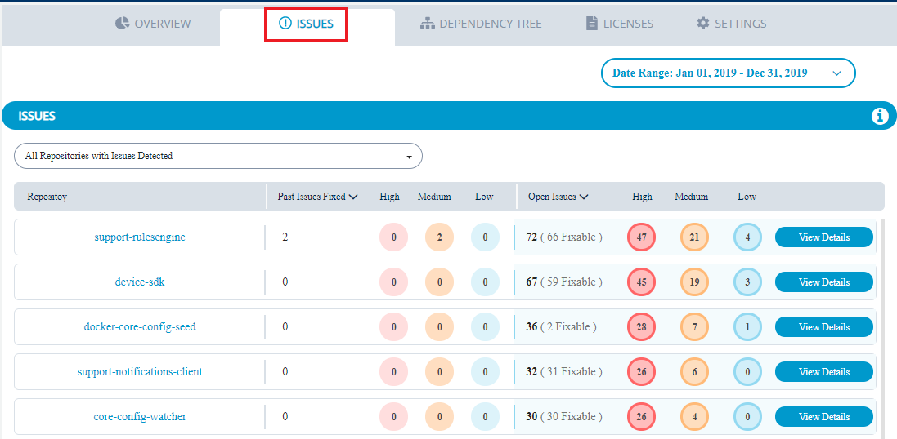
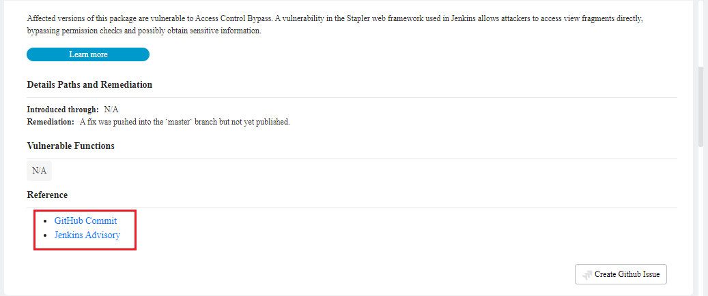

# Investigate and Remediate Vulnerabilities

Vulnerabilities in project code can cause a range of problems for your project and the developers who use it. CommunityBridge Security shows vulnerabilities in your repositories and helps you to remediate risks with automated updates and patches. 

For each repository, CommunityBridge Security maps the dependencies and correlates them with the vulnerability database. You can investigate and remediate certain types of vulnerabilities in your Git repository. For example, an injection vulnerability means your project does not guard against code being injected in your system to extract, damage, or destroy data. Investigate the issue details to find out how to remediate the vulnerability if possible.

If possible, address a vulnerability by upgrading to a vulnerability-free version of the package you are using. If you cannot upgrade, because no sufficient direct upgrade is available or because the upgrade includes breaking changes, another option is to apply a patch. A patch changes the locally installed package file to fix the vulnerability. If an upgrade or patch is unavailable, assess the issue and weigh risk against effort. If the risk is high, consider removing the dependency.

**Do these steps:**

1.Select **Issues** from the top menu.  
The dashboard shows all vulnerabilities with their details, and total number of open and fixed issues. By default, only Open status issues appear—use the filter to show Fixed issues.

2. You can search for a particular repository using the Repositories drop-down list. You can select the required repositories and check the issues and their details. 

3.You can view the total number of open and fixed issues for a repository by clicking the **View Details**. 

4. You can see the Open issues related to the repository. You can also refine the issues based on the priority such as High, Medium and Low.  

5.Click the  icon to see more details and to investigate the vulnerabilities. You can check the following details related to vulnerabilities:

* Details about the issue, and when possible, a remediation and references to the corresponding PR, issue, CWE or CVE record, and so on.
* Read the details and decide how you want to fix the vulnerability, for example, by applying a Snyk patch

6.You can also  Click a CWE-\# link or CVE-\# link to read a description, references, and so on, about the vulnerability. The [Common Weakness Enumeration website](https://cwe.mitre.org/) or [Common Vulnerabilities and Exposures website](https://cve.mitre.org/) shows an identifier and details for the vulnerability by an identifier.

7.Investigate the vulnerabilities by opening the provided links to go directly to various websites for specific information about the vulnerability. For example:

* Click a **GitHub PR** link, a **GitHub Commit**, and then a **GitHub Issue** link to learn more about the corresponding pull request, commit, and issue, respectively.

