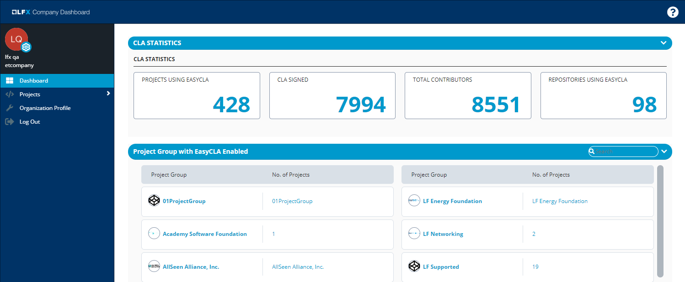
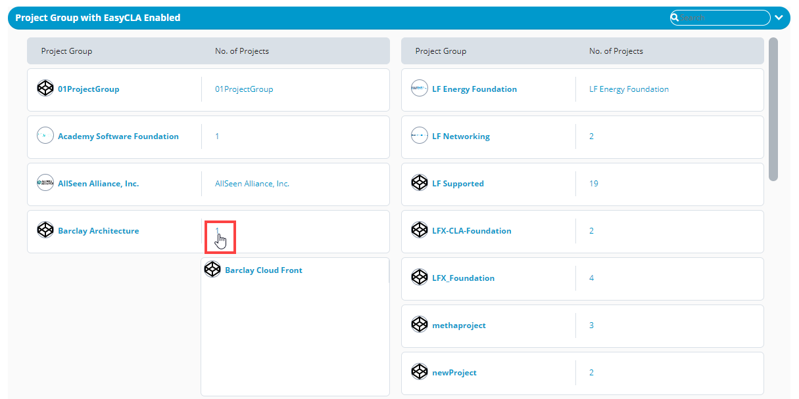

# Dashboard

Following are the aggregate data of all the projects that use LFX EasyCLA.

### CLA STATISTICS 

* **PROJECTS USING EASYCLA** shows the total number of projects that are using EasyCLA to streamline the CLA signing process for the contributors.
* **CLA SIGNED** shows total number of Contributor License Agreements—ICLA \(Individual CLA\) and CCLA \(Corporate CLA\)—signed by all the member companies of the Linux Foundation. This number doesn't include the number of approved contributors.
* **TOTAL CONTRIBUTORS** shows the total number of individual and corporate contributors including approved contributors of companies.
* **REPOSITORIES USING EASYCLA** shows total number of git repositories that are EasyCLA enabled.

## Project Group with EasyCLA Enabled


**Project Group** is also referred as **Project** in the document.


​A project group is a parent project of individual projects. Navigate to a project or type a project name in the search box and press Enter to view the project. Click a project to navigate to project details page. For project details, see [Projects](projects/).

* **Project Group** shows the project name.
* **No. of Projects** shows the total number of projects that are EasyCLA enabled under a project group. Click the number to see the project names as shown in the following image.  **Note:** A project name under **No. of Projects** indicates that it is an individual project and doesn't come under any project group.

Click a project group or a project under a project group to view the  EasyCLA information.

​

