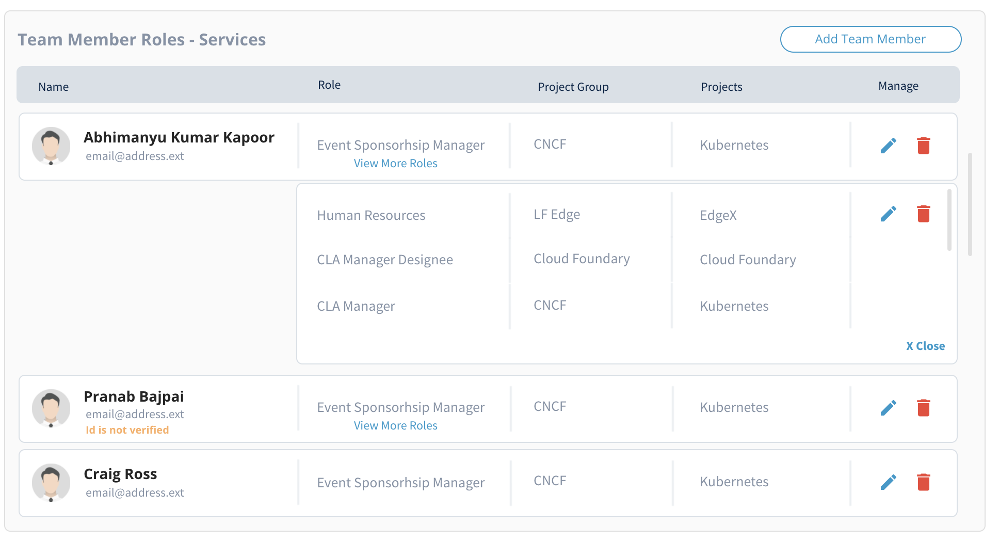

# Manage Organization

Only organization administrators can edit and update organization information. You are entitled as organization administrators if you are:

* Added by another administrator
* Primary contact for the organization
* The first CLA Manager assigned when the company was created (if no other organization administrator exists)

Organization Profile displays the following sections:

* [Organization Profile Header](manage-organization.md#organization-profile-header)
* [Team Member Roles - Services](manage-organization.md#team-member-roles-services)

## Organization Profile Header

This section shows organization name, logo, and last updated time and date.

### To Edit Organization Information:


**Note:** Only organization administrators can edit organization information.


1. Click  on the profile header.

2\. Update or edit logo, name, and website of an organization, and click **Save**.


**Note:** Only SVG files are accepted for company logo.


## Team Member Roles - Services

This section shows a table that lists your team members— their profile photos, names, email addresses, and their roles with project groups and projects they are associated with. If a member has more than one role, click **View More Roles** to know about the other roles the member is assigned with. CLA roles are displayed automatically as per the organization profile information.

Only company administrators can submit a ticket requesting for a change in team member role. Clicking **Submit a Support Ticket** under Request a change to submit a ticket requesting to change the CLA role.

