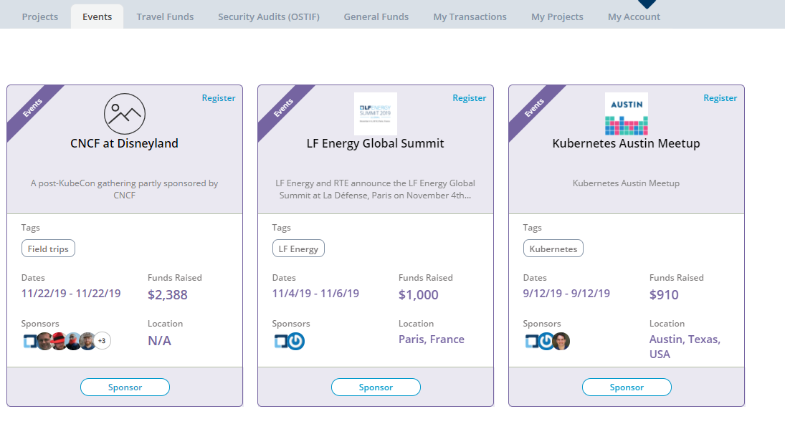
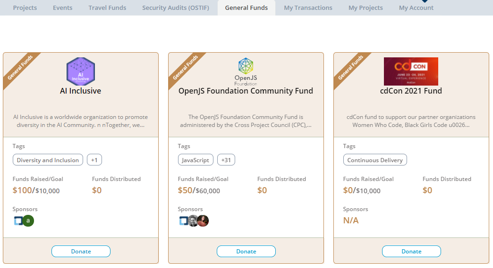

# Dashboard Overview

Dashboard gives an overview of projects, events, travel funds, security audits, and initiatives of Crowdfunding.

1. Go to [Crowdfunding](https://crowdfunding.lfx.linuxfoundation.org/).
2. Navigate to tabs, such as [Projects](./#Dashboard-ProjectsandMentorships), [Events](./#Dashboard-Events), [Travel Funds](./#Dashboard-TravelScholarships), [Security Audits \(OSTIF\)](./#security-audits-ostif), [General Funds](./#general-funds), and to learn more about each.
3. Sign in to [manage your crowdfunding account](../manage-your-crowdfunding-account.md)
4. To participate:
   * [Apply to raise fund for a project](../apply-for-crowdfunding/)
     * [Add a GitHub project](../apply-for-crowdfunding/add-a-github-project.md)
     * [Add a Git project](../apply-for-crowdfunding/add-a-git-project.md)
     * [Add a project for security audit](../apply-for-crowdfunding/add-a-project-for-security-audit.md)
     * [Add General Fund](../apply-for-crowdfunding/add-general-fund.md)
     * [Add an event](../apply-for-crowdfunding/add-an-event.md)
     * [Add a travel fund](../apply-for-crowdfunding/add-a-travel-fund.md)
   * [Donate/Sponsor to projects](../donate-sponsor/)
   * [Register to participate in an event](../register-for-an-event.md)

## Projects 

**Projects** tab includes Git-based projects. Each project card shows the following information:

* **Project name and logo** - click on the project title/logo to navigate to[ project ](projects.md)details page
* **Tags** - technologies the project is associated with
* **Funds Raised** - total funds raised so far
* **Goal** - total funding goal for the project
* **Funds Distributed** - total expenses so far
* **Sponsors** - images of sponsors \(Individuals and Organizations\) for the project
* **Donate** - Click to [donate](../donate-sponsor/) funds to the project they want to support

## Events 

**Events** tab shows events, such as forums or conferences.  Each event card shows the following information:

* **Event name and logo** - click on the event title/logo to navigate to [event ](events.md)details page
* **Tags** - technologies the event is associated with
* **Dates** - beginning and end dates of the event
* **Funds Raised** - total amount of funds raised for the event
* **Location** - ****the place where the event takes place
* **Sponsors** - images of sponsors \(Individuals and Organizations\) for the event
* **Sponsor** - Click to [sponsor events](../donate-sponsor/sponsor-events.md) they want to support
* **Register** - Click to [register for an event](../register-for-an-event.md) they want to attend

## Travel Funds 

**Travel Funds** includes diversity and need-based travel funding. Each travel fund card shows the following information:

* **Travel Fund name and logo** - click on the travel fund title/logo to navigate to [travel fund](travel-funds.md) details page
* **Tags** - technologies the travel related event or meet-up is associated with.
* **Dates** - start date and end date of the meet up or event
* **Funds Raised** - total funds raised so far
* **Sponsors** - images of sponsors \(Individuals and Organizations\) for the travel fund.
* **Funds** **Distributed** - total expenses so far for the event
* **Donate** - Click to [donate](../donate-sponsor/) to travel funds they want to support

## Security Audits \(OSTIF\)

**Security Audits \(OSTF\)** tab includes projects that applied for a security audit performed by [Open Source Technology Improvement Fund](https://ostif.org/the-ostif-mission/). Each Security Audit card shows the following information:

* **Project name and logo** - click on the project title/logo to navigate to[ security audit](security-audit.md) details page
* **Tags** - technologies the project is associated with
* **Funds Raised** - total funds raised so far
* **Goal** - ****total funding goal for the project
* **Sponsors** - images of sponsors \(Individuals and Organizations\) for the project
* **Funds Distributed** - total expenses so far
* **Donate** - Click to [donate](../donate-sponsor/) funds to the project they want to support

## General Funds

General Funds section includes open-source initiative projects for which people have raised funds.

Each General Fund card shows the following information:

* **Fund name and logo** - click on the title/logo to navigate to[general funds](general-funds.md) details page
* **Tags** - technologies the project is associated with
* **Funds Raised** - total funds raised so far
* **Goal** - ****total funding goal for the project
* **Sponsors** - images of sponsors \(Individuals and Organizations\) for the project
* **Funds Distributed** - total expenses so far
* **Donate** - Click to [donate](../donate-sponsor/) funds to the project they want to support

\*\*\*\*

