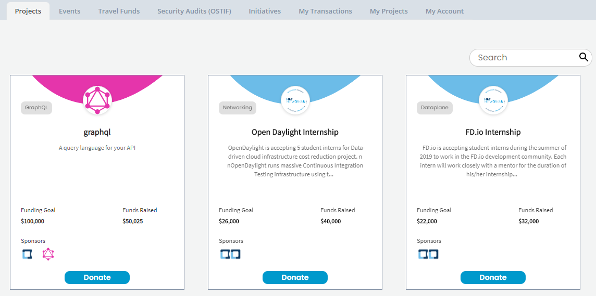
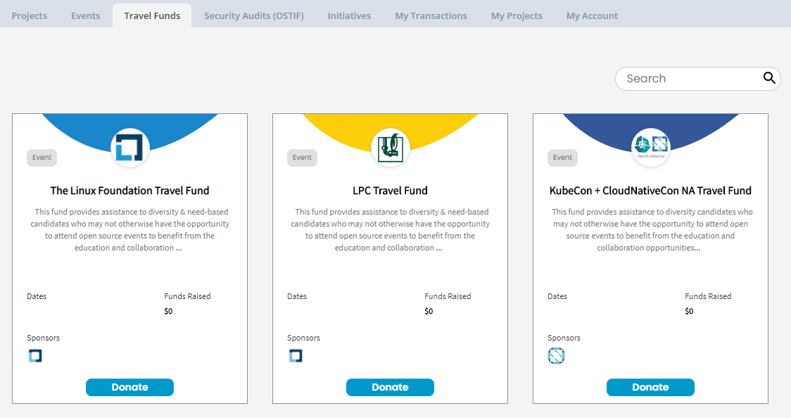
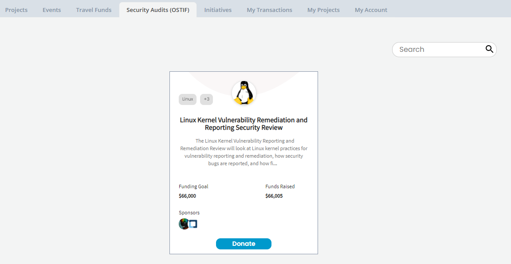
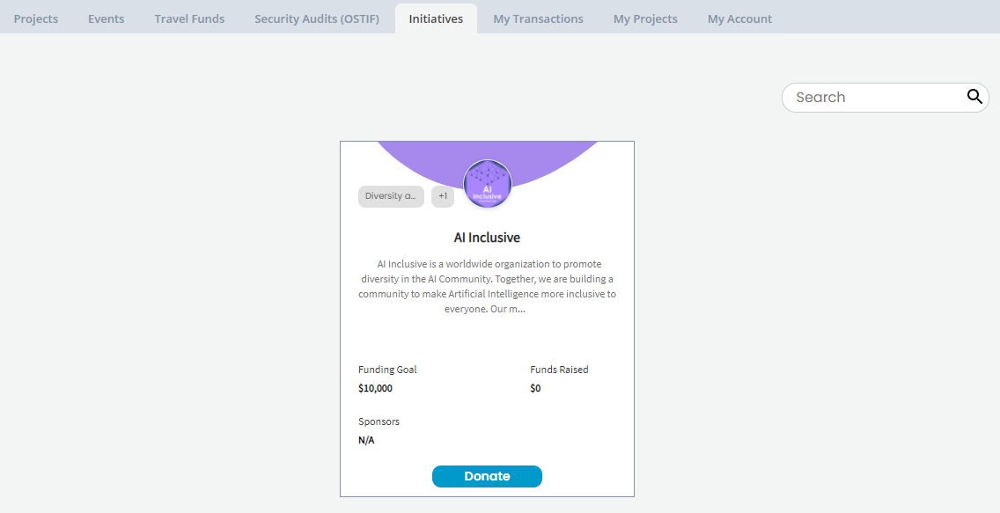

# Dashboard

Dashboard gives an overview of projects, events, travel funds, security audits, and initiatives of Crowdfunding.

1. Open [Crowdfunding](https://crowdfunding.lfx.linuxfoundation.org/).
2. From [Projects ](./#Dashboard-ProjectsandMentorships)tab, click a project to navigate to the project dashboard.
3. Navigate to other tabs, such as [Events](./#Dashboard-Events), [Travel Funds](./#Dashboard-TravelScholarships), [Security Audits \(OSTIF\)](./#security-audits-ostif), [Initiatives](./#initiatives), and to learn more about each.
4. Sign in to view [My Transactions](./#my-transactions), [My Projects](./#my-projects), and [My Account](./#my-account) tabs, and to learn more about each. 
5. To participate:
   * [Apply to raise fund for a project](../apply-for-crowdfunding/)
     * [Add a GitHub project](../apply-for-crowdfunding/add-a-github-project.md)
     * [Add a Git project](../apply-for-crowdfunding/add-a-git-project.md)
     * [Add a project for security audit](../apply-for-crowdfunding/add-a-project-for-security-audit.md)
     * [Add initiatives](../apply-for-crowdfunding/add-initiatives.md)
     * [Add an event](../apply-for-crowdfunding/add-an-event.md)
     * [Add a travel fund](../apply-for-crowdfunding/add-a-travel-fund.md)
   * [Donate/Sponsor to projects](../donate-sponsor/)
   * [Register to participate in an event](../register-for-an-event.md)

## Projects 

**Projects** tab includes Git-based projects. Each project card shows the following information:

* Project name, logo, and description
* Technologies or Categories the project is associated with
* Funding Goal shows total funding goal for the project
* Funds Raised shows total funds raised so far
* Sponsors shows images of sponsors \(Individuals and Organizations\) for the project
* **Donate** allows users to donate funds to the project they want to support

To learn more, see [Projects](projects.md).

## Events 

**Events** tab events, such as forums or conferences.  Each event card shows the following information:

* Name, logo, and description of the event.
* Dates shows the beginning and end dates of the event.
* Funds Raised shows total amount of funds raised for the event.
* Location shows the place where the event takes place.
* Sponsors shows images of sponsors \(Individuals and Organizations\) for the event.
* **Sponsor** allows users to sponsor events they want to support.
* **Register** allows users to register for an event they want to attend.

To learn more, see [Events](events.md).

## Travel Funds 

**Travel Funds** includes diversity and need-based travel funding. Each travel fund card shows the following information:

* Travel Fund name, logo, and description.
* Technologies or Categories the travel related event or meet-up is associated with.
* Dates show the start date and end date of the meet up or event.
* Funds Raised shows total funds raised so far.
* Sponsors shows images of sponsors \(Individuals and Organizations\) for the travel fund.
* **Donate** allows users to donate to travel funds they want to support.

To learn more, see [Travel Funds](travel-funds.md).

## Security Audits \(OSTIF\)

**Security Audits \(OSTF\)** tab includes projects that applied for a security audit performed by [Open Source Technology Improvement Fund](https://ostif.org/the-ostif-mission/). Each Security Audit card shows the following information:

* Project name, logo, and description
* Technologies or Categories the project is associated with
* Funding Goal shows total funding goal for the project
* Funds Raised shows total funds raised so far
* Sponsors shows images of sponsors \(Individuals and Organizations\) for the project
* **Donate** allows users to donate funds to the project they want to support

To learn more, see [Security Audit](security-audit.md).

## Initiatives

Initiatives section includes open-source initiatives for which people have raised funds. You can click an initiative to learn more about it. For details to know about an initiative, see the [project/initiative details](projects.md). Click **Donate** to support the initiative. To know more, see [Initiatives](initiatives.md).

## My Transactions

My Transactions shows your monthly donations and lists all your transactions. For details, see [My Transactions](../manage-your-crowdfunding-account.md#my-transactions).

## My Projects

My Projects lets you see all the projects, security audits, initiatives, events, and funds that you maintain all in one place. You can see the status of a project, for example "Pending approval".

Click a project to see the fund details.Click **Edit** on a card to edit the fund details.

## My Account

**My Account** lets you manage your organization, and payment method. For details, see [My Account](../manage-your-crowdfunding-account.md#my-account).

\*\*\*\*

