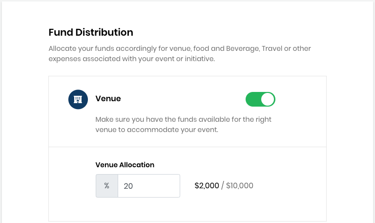
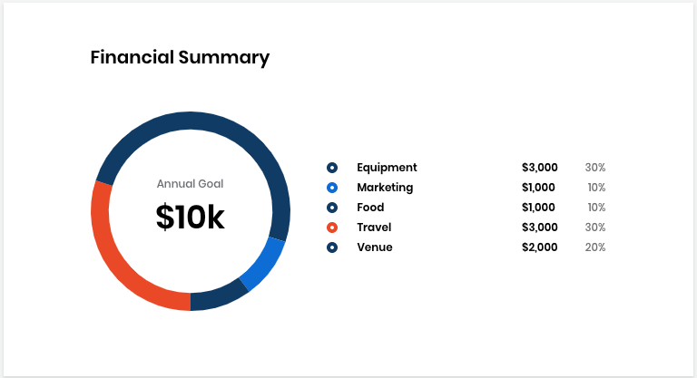

# Event Application

### Event Details

The following table lists all the fields in the **Event Details** panel of the Event Application:

| Field Name | Description |
| :--- | :--- |
| **Event name** | An event name which must be unique. **Note:** Funds of a different type can use the same name. For example, an Event fund and a Project fund can use the same name. |
| **Topic** | Type of industry that relates to your event. Click **+Add topic**  after you select a category from the list. |
| **Event Summary** | A brief description about your event. |
| **Website URL** | A link to the website that you want to associate with the event funding. |
| **Registration URL** | The specific URL where people can register or sign-up for your event. |
| **Start Date** | Start date of your event. Click the calendar icon to select date. |
| **End Date** | End date of your event. Click the calendar icon to select date. |

### Event Location

The following table lists all the fields in the **Event Location** panel of the Event Application:

| Field Name | Description |
| :--- | :--- |
| **City** | City name where the event is to be conducted. |
| **Country** | Country name where the event is to be conducted. |

### Event Branding

The following table lists all the fields in the **Event Branding** panel of the Event Application:

| Field Name | Description |
| :--- | :--- |
| **Event Logo** | A symbol or other design adopted by your organization that identifies your project. Click **Browse** to upload a file. File size should be 2MB max and in JPG, PNG, or SVG format. |
| **Accent Color** | A color that's a part of the event's brand. Enter a **hexadecimal number** or click in the field to open the color picker. |

### Event Beneficiaries

Event Beneficiaries are individuals who receive invitation from Expensify \(an expense management application\) to submit [reimbursement](get-reimbursed.md) for their expenses.

| Name | Description |
| :--- | :--- |
| **Name** | Name of the person who you want to designate as a beneficiary of funds. |
| **Email** | Email of the person who you want to designate as a beneficiary of funds. |

After you enter the name and email address of the beneficiaries, click **+Add beneficiary** to add the person to the list. To add more beneficiaries, click **+ Add beneficiary** and complete the fields that appear.


**Note:** Only the project administrator can add or remove beneficiaries. The finance team is notified and adjusts the Expensify accounts accordingly.


### Event Budget

**Sponsorship Goal** is a total funding goal amount for the year. The amount is a sum of the individual goal amounts.


Any funds remaining at year end can be carried forward to the next year.


### Fund Distribution

**Fund Distribution** enables goals for how you want to distribute funds for your event. Enter a percentage of your total sponsorship goal amount to designate towards the goal. Following are various goals towards which you can distribute your fund:

* **Venue:** You can use funds allocated for this category to pay for a venue for your event. Ensure that you have enough funds to accommodate your event.
* **Food and Beverage:** You can use funds allocated for this category to buy coffee, snacks, foods and beverages, and so on for event attendees.
* **Travel:** You can use funds allocated for this category to provide travel assistance to community members to attend events organized by you. Ensure that you have enough funds to sponsor air tickets, hotel stays, and so on for eligible members.
* **Equipment:** You can use funds allocated for this category to buy equipment, such as microphones, speakers, projectors, screens, and so on, for your event.
* **Marketing:** Market your project event to attract sponsors, and individuals to contribute to the project. You can use funds allocated for this category to promote your event by doing digital marketing, designing event websites, providing t-shirts to attendees, and so on.

### Event Funding Goal\(s\) \(Optional\)

If you want to add custom goals for your event, click **Add Event Goal** and complete the fields that appear. These goals can include an all-attendee reception at a separate venue or the funds needed to bring in a featured guest speaker.

Click **Delete** next to **Custom Goal** to delete any custom goal that you have added.

The following table lists all the fields in the **Custom Goal** panel of the Event Application.

| Field Name | Description |
| :--- | :--- |
| **Goal Name** | Name of your goal which must be different from the listed goals. |
| **Goal Description** | A brief description about your goal. |
| **Goal Color** | A color that you want your event goal to use. Enter a **hexadecimal number** or click in the field to open the color picker.  |
| **Goal Icon** | A symbol or other design adopted by your organization that identifies your page. Click **Browse** to upload a file. File size should be 2MB max and in JPG, PNG, or SVG format. |
| **Goal Allocation** | A percentage of the total goal amount that you want designated for this goal. |

### Event Sponsorship Tier\(s\) \(Optional\)

You can offer your event sponsors different tiers of sponsorship. Each tier should have a unique name \(for example, "Platinum Sponsorship" or "Lunch Sponsorship"\), and tiers have different benefits attached to them like a logo appearing on a website and signage, or being included in email announcements promoting the event. 

To add sponsorship tiers to your event, click **Add Sponsorship Tier** and complete the fields that appear.

| Field Name | Description |
| :--- | :--- |
| **Tier name** | Name of your sponsorship tier. This name will appear on your Funding event page. |
| **Tier Description** | A brief description about your sponsorship tier. |
| **Tier Color** | A color that you want your event tier to use. Enter a **hexadecimal number** or click in the field to open the color picker. |
| **Tier Icon**  | A symbol or other design adopted by your organization that identifies your project. Click **Browse** to upload a file. File size should be 2MB max and in JPG, PNG, or SVG format. |
| **Tier Minimum** | The minimum dollar amount that a sponsor can donate to the tier. |

### Financial Summary

The Financial Summary shows the annual financial goal and progress towards it by individual goal. A distributed report is shown based on your selection in the **Fund Distribution** section. 

### Terms and Conditions

Read and agree to the Terms and Conditions, and **Submit** the application.


After The Linux Foundation reviews the application, you will receive an email notification with a review decision. 


